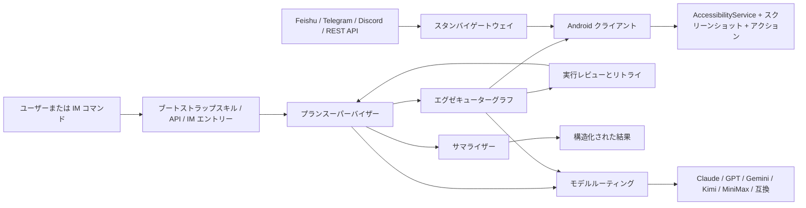

<p align="center">
  <strong>言語:</strong> <a href="./README.md">English</a> | <a href="./README.zh-CN.md">简体中文</a> | <a href="./README.ja-JP.md">日本語</a>
</p>

<p align="center">
  
</p>

<p align="center">
  <a href="https://trendshift.io/repositories/183339"></a>
</p>

<p align="center">
  <a href="#workbuddyへのインストール"></a>
  <a href="#deepseek-harnessでopenguiを使う"></a>
  <a href="./skills/open-gui-bootstrap/SKILL.md"></a>
  
  <a href="./docs/get-started.ja-JP.md"></a>
</p>

<p align="center">
  <strong>Android 向けのモバイル GUI エージェントフレームワーク。</strong>
</p>

<p align="center">
  OpenGUI は、AI エージェントが実機上の Android アプリ UI を見て、理解し、操作できるようにします。
</p>

<p align="center">
  <strong>WorkBuddy または DeepSeek Harness で OpenGUI を使えます。</strong><br>
  プラグインをインストールしてスマートフォンを接続し、自然言語でタスクを指示します。バックエンド一式のデプロイは不要です。
</p>

## 機能概要

OpenGUI は実際の画面を読み取り、自然言語の指示でスマートフォンの操作やテストを行います。

- **スマートフォン操作**：アプリの起動、タップ、スワイプ、文字入力、画面遷移を組み合わせた手順を実行します。
- **アプリテスト**：機能や操作フローを確認し、問題、再現手順、スクリーンショット、結果を記録します。
- **情報とコンテンツ**：画面情報の読み取り、情報整理、フォーム入力、SNS 投稿の下書きを作成します。
- **実行の可視化**：WorkBuddy の作業画面で端末画面、手順、レポートを確認し、必要に応じて手動操作や停止ができます。
- **ホスト連携**：WorkBuddy と DeepSeek Harness に対応し、DSH プラグインでは管理対象ブラウザも操作できます。

## よく使うコマンド

インストールと認証後、対応するホストのチャットに入力します。`【入力項目】` は実際のタスク内容に置き換えてください。

| 用途 | ホスト | 入力例 |
|---|---|---|
| OpenGUI を開く | WorkBuddy | `/opengui` |
| 接続端末の確認 | WorkBuddy | `/opengui 接続された端末を一覧表示してください。スマートフォンは操作しないでください。` |
| 端末操作 | WorkBuddy | `/opengui 設定を開き、ホーム画面に戻って、表示を確認したら終了してください。` |
| アプリテスト | WorkBuddy | `/opengui 【アプリ／画面】の【機能や操作フロー】をテストし、問題、手順、スクリーンショットを記録してください。【終了条件】で停止してください。` |
| 小紅書の下書き | WorkBuddy | `/opengui 小紅書で【テーマ】の画像付き投稿の下書きを作成し、公開前に停止してください。` |
| DSH でタスク実行 | DeepSeek Harness | `@OpenGUI 設定を開いて Android のバージョンを報告してください。` |

## WorkBuddyへのインストール

**macOS（Apple Silicon / Intel）、WorkBuddy 5.5.3 以降**に対応しています。現在の公開版は [0.4.0 公開テスト版](https://github.com/Core-Mate/OpenGUI/releases/tag/opengui-workbuddy-v0.4.0)です。

**手順1.Terminalコマンドでインストール**

macOS の Terminal で次を実行します：

```sh
cd "$HOME" && curl -fsSL https://raw.githubusercontent.com/Core-Mate/OpenGUI/main/workbuddy-plugin/install.sh | bash
```

スクリプトは必要なファイルを検証し、ランタイムと OpenGUI を設定します。

[install.sh を個別にダウンロード](https://raw.githubusercontent.com/Core-Mate/OpenGUI/main/workbuddy-plugin/install.sh)して `bash /実際のパス/install.sh` で実行することもできます。

**手順2.Skillとコネクターを認証**

WorkBuddy の「专家·技能·连接器 → 技能」で OpenGUI を選び、認証します。続いて「连接器」で OpenGUI を認証してください。**Skill とコネクターの両方に認証が必要です。**


OpenGUI が見つからない場合は「自定义连接器」の MCP サービスも確認してください。表示されない、または設定が反映されない場合に限り、他のタスクを終了して ⌘Q で WorkBuddy を終了し、開き直します。認証ページが自動で開かない場合は、Terminal の `AUTHORIZATION_GUIDE` に表示されたファイルを開いてください。

**手順3.接続を確認して使い始める**

Android スマートフォンの USB デバッグを有効にして PC に接続し、端末上で USB デバッグを承認します。WorkBuddy で `/opengui` に続けて実行したい指示を入力してください。

試してみる：小紅書の投稿を準備

```text
/opengui 小紅書で【テーマ】の画像付き投稿の下書きを作成してください。【素材】を使い、公開前に停止してください。
```

試してみる：Vibe Testing

```text
/opengui 【アプリ／画面】の【機能や操作フロー】をテストし、特に【確認する点】を確認してください。問題があれば手順とスクリーンショットを記録し、【終了条件】に達したら停止してください。
```

## DeepSeek HarnessでOpenGUIを使う

macOSでは、`main` ブランチの安定したインストーラーSkillをCodexに実行させる方法が最短です。実行するたびに最新の安定版OpenGUIプラグインを解決してインストールし、ロールバック用に明示的なバージョン指定も利用できます。Node.js 22.19以降または24以降が必要で、互換性のあるDSHバージョンは自動的にインストールされます。次の内容を1つのプロンプトとして送信します：

```text
Install and run the OpenGUI installer Skill from https://github.com/Core-Mate/OpenGUI/tree/main/deepseek-harness-plugin/skills/opengui-coremate-install for my DSH web profile. Install the latest stable release. Proceed autonomously, and only pause when I need to authorize or select a phone, add or select a DSH workspace, or provide fallback visual-model credentials.
```

Skillは公開ReleaseのパッケージとチェックサムをダウンロードしてSHA-256を検証し、OpenGUIプラグインだけをインストールします。必要な場合はDSHを起動して開き、既存のプラグインと設定は保持します。管理対象のDSHを再起動したか、既存のプロセスを終了してインストーラーを再実行する必要があるかは、インストーラーが表示します。LinuxまたはWindowsでは、[手動パッケージガイド](./deepseek-harness-plugin/README.md#1-download-the-release-package)を使用してください。

対応する DSH バージョンは[インストーラーの互換性リスト](./deepseek-harness-plugin/skills/opengui-coremate-install/dsh-compatibility.json)を参照してください。既定は `0.1.1-rc.2` で、`--dsh-version VERSION` でリスト内のバージョンを指定できます。他のプラグイン、ワークスペース、モデル設定、認証情報は保持されます。バージョン変更とロールバックの制約は[プラグイン導入ガイド](./deepseek-harness-plugin/README.md#requirements-and-support)に記載しています。

インストール後、DSHでワークスペースを追加または選択し、認証済みのAndroidスマートフォンを接続して選択してから、次を送信します：

```text
@OpenGUI Open Settings and report the Android version
```

このプラグインは、OpenGUIバックエンド一式を必要とせず、DSHにスマートフォンとブラウザの操作機能を追加します。現在のソース実装はDSH Sessionごとに1つのルートタスクを受け付け、デバイスが競合しない別のTabも受け付けます。管理対象ブラウザは引き続きグローバルに直列実行されます。これはソースの動作説明であり、リリース済みであることを示すものではありません。[ユースケース](./deepseek-harness-plugin/docs/use-cases.md)を確認するか、[v0.1.13リリースパッケージ](https://github.com/Core-Mate/OpenGUI/releases/tag/dsh-coremate-mobile-v0.1.13)をダウンロードできます。

GUI 操作には画像入力とツール呼び出しに対応したモデルが必要です。DSH は現在のセッションモデルを優先し、必要な場合だけ予備の視覚モデルを設定します。詳しくは[プラグインガイド](./deepseek-harness-plugin/README.md)を参照し、実際のタスクで実行品質、所要時間、費用を確認してください。

## OpenGUIスタック一式を実行する

バックエンドと Android クライアントを自分で運用する場合や、Feishu、Telegram、Discord、REST API からタスクを配信する場合に利用します。WorkBuddy と DSH のプラグインだけを使う場合、このデプロイは不要です。

リポジトリのルートで Claude Code、Codex、OpenCode のいずれかを開き、次を送信します：

```text
Read ./skills/open-gui-bootstrap/SKILL.md and help me run OpenGUI. Only ask me for phone-side actions.
```

フルスタックの Android クライアントには Android 11（API 30）以降、USB デバッグ、ユーザー補助サービス、オーバーレイ権限、バッテリー最適化の除外が必要です。モデル設定、手動起動、端末の認証は[導入ガイド](./docs/get-started.ja-JP.md)と[Android 権限ガイド](./docs/android-permissions.ja-JP.md)を参照してください。

導入後は `server` ディレクトリで CLI を実行できます：

```bash
pnpm opengui -- devices --json
pnpm opengui -- do "Observe the current Android screen, summarize what you see, and stop" --json
pnpm opengui -- status <executionId> --json
pnpm opengui -- cancel <executionId> --json
```

`do` は非同期で `executionId` を返します。その ID を `status` に渡して状態を確認し、`cancel` で停止できます。外部からの操作は[CLI / API ガイド](./docs/codex-remote-control.ja-JP.md)、Discord は[設定ガイド](./docs/DISCORD.ja-JP.md)を参照してください。

## 最近の更新

- `[2026.10.8]` [WorkBuddy 0.4.0 公開テスト版](https://github.com/Core-Mate/OpenGUI/releases/tag/opengui-workbuddy-v0.4.0)を公開しました。Terminal からのインストールと、導入後に自動で開く認証ガイドに対応しています。
- `[2026.9.1]` [DSH プラグイン 0.1.13](https://github.com/Core-Mate/OpenGUI/releases/tag/dsh-coremate-mobile-v0.1.13)を公開しました。
- `[2026.5.16]` [Codex / Claude Code リモートコントロール](./docs/codex-remote-control.ja-JP.md)を追加しました。ローカル REST API、`pnpm opengui -- ...` CLI、[`open-gui-remote-control`](./skills/open-gui-remote-control/SKILL.md) Skill により、コーディングエージェントから Android アプリタスクをディスパッチできます。
- `[2026.5.9]` [Discord IM エントリー](./docs/DISCORD.ja-JP.md)を追加しました。プレフィックスコマンド、スラッシュコマンド、allowlist、guild 単位のコマンド登録に対応し、Discord チャンネルから Android タスクをリモート実行できます。
- `[2026.5.7]` Docker ベースのバックエンド起動時に、一般的な PostgreSQL / Redis ポート競合を避けられるようローカル起動フローを強化しました。
- `[2026.5.1]` バックエンドのオンボーディングとして、`.env.example`、起動時チェック、graph agent 向け VLM 環境変数設定を整備しました。

## 必要な環境と制限

| 利用方法 | コンピューターと実行環境 | Android 端末の準備 |
|---|---|---|
| WorkBuddy プラグイン | macOS（Apple Silicon / Intel）、WorkBuddy 5.5.3 以降。専用ランタイムはインストーラーが用意します。 | USB デバッグを有効化して承認。PC 側の ADB / scrcpy を使用し、バックエンド一式や本リポジトリの Android クライアントは不要です。 |
| DSH プラグイン | macOS、Linux x64、Windows x64。Node.js と DSH の要件は[プラグインガイド](./deepseek-harness-plugin/README.md#requirements-and-support)を参照してください。 | USB デバッグを有効化して承認し、DSH で端末を選択。バックエンド一式や本リポジトリの Android クライアントは不要です。 |
| フルスタック | ローカルバックエンドとビルド環境。[導入ガイド](./docs/get-started.ja-JP.md)を参照してください。 | Android 11 以降。クライアントのユーザー補助、オーバーレイ、バッテリー関連の権限が必要です。 |

- 一部の端末ではメーカー独自の USB 入力権限も必要です。接続診断の案内に従って端末側で設定してください。
- WorkBuddy は現在の会話モデルを使用します。DSH のセッションモデルとバックエンドのモデル設定は、それぞれ別の設定経路です。
- 実行品質はモデル、アプリの画面、ネットワーク、タスクの長さに左右されます。長時間タスクや端末ごとの信頼性は、引き続き実環境での検証が必要です。
- WorkBuddy の SMS ログインは既定で公式 CoreMate アカウントサービスを利用します。オンラインのモデル設定は読み込みません。タスクのスクリーンショットは現在の WorkBuddy モデルに送信され、ローカルプレビュー動画はフレームごとには送信されません。各方式のデータフローは[WorkBuddy ガイド](./workbuddy-plugin/README.md)と[DSH ガイド](./deepseek-harness-plugin/README.md)を参照してください。

## Roadmap

- 実際のアプリ例とテストレポートを追加する。
- ローカルセットアップをより一コマンドに近づける。
- すぐに実行できる phone-use タスクテンプレートを増やす。
- 実行リカバリーと失敗レポートを改善する。
- Android GUI Agent の信頼性 benchmark タスクを追加する。
- モデル設定とコスト削減プロファイルのドキュメントを拡充する。
- OpenGUIの技術スタック一式を自分で運用したくないチーム向けに、ホスト型OpenGUI Agentサービスを提供する。

## システム構成

この図はフルスタックのバックエンドと Android クライアントの経路を示します。WorkBuddy と DSH は、それぞれのプラグインランタイムを使用します。



### コアランタイムコンポーネント

- **バックエンドグラフ**: `server/apps/backend/src/modules/graph-agent/graph/`
- **タスク API**: `server/apps/backend/src/modules/task/task.controller.ts`
- **スタンバイディスパッチ**: `server/apps/backend/src/common/ws/standby.gateway.ts`
- **IM チャンネルディスパッチ**: `server/apps/backend/src/modules/im-channel/`
- **Android スタンバイ接続**: `client/core_network/src/main/java/com/coremate/opengui/network/websocket/StandbySocketManager.kt`
- **Android 実行パス**: `client/core_accessibility/src/main/java/com/coremate/opengui/accessibility/GestureService.kt`

## ドキュメント

- [WorkBuddy の導入確認とトラブルシューティング](./workbuddy-plugin/INSTALL.md)
- [WorkBuddy プラグインガイド](./workbuddy-plugin/README.md)
- [DeepSeek Harness プラグインガイド](./deepseek-harness-plugin/README.md)
- [skills/open-gui-bootstrap/SKILL.md](./skills/open-gui-bootstrap/SKILL.md)
- [docs/get-started.ja-JP.md](./docs/get-started.ja-JP.md)
- [server/apps/backend/README.md](./server/apps/backend/README.md)
- [docs/DISCORD.ja-JP.md](./docs/DISCORD.ja-JP.md)
- [client/README.md](./client/README.md)
- [CONTRIBUTING.md](./CONTRIBUTING.md)
- [SECURITY.md](./SECURITY.md)
- [CLAUDE.md](./CLAUDE.md)

## コミュニティ / サポート

[OpenGUI Discordコミュニティ](https://discord.gg/pqHHw7XgJ3)では、GUIエージェント技術、実際のユースケース、リリース情報について話し合えます。確認済みのWeChatコミュニティへの参加方法は、準備ができ次第ここで公開します。

ホスト型OpenGUI Agentサービスの開始後、コミュニティメンバーはAgentのトライアルクレジットを申請できるようになります。提供数、申請条件、有効期間はサービス開始時に案内します。

特に有用なプロジェクトフィードバック:

- バグや機能リクエストの Issue を作成する
- 実際のユースケースやデプロイメントのフィードバックを共有する
- ドキュメント、インテグレーション、修正のコントリビューション

## ライセンス

OpenGUI は Business Source License 1.1 (BUSL-1.1) の下でソース公開されています。

非本番目的でのソースのコピー、修正、配布、使用が可能です。本番使用、商用使用、ホスティングサービス、商用製品への統合には、Core-Mate からの別途商用ライセンスが必要です。

このバージョンについて:

- 変更日: 2030-04-29
- 変更ライセンス: Apache License, Version 2.0

変更日まではパブリックソースですが、OSI 認定のオープンソースではありません。

[LICENSE](./LICENSE) を参照してください。
