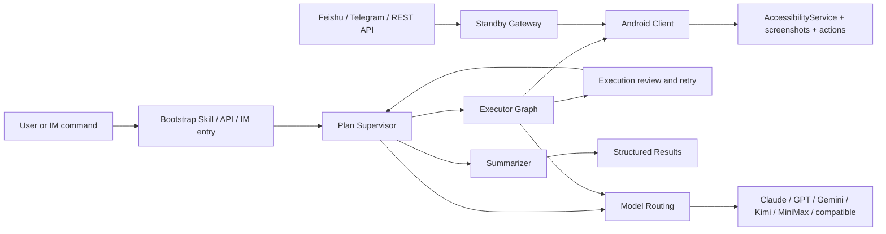

<p align="center">
  <strong>Language:</strong> <a href="./README.md">English</a> | <a href="./README.zh-CN.md">简体中文</a>
</p>

<p align="center">
  
</p>

<p align="center">
  <a href="./skills/open-gui-bootstrap/SKILL.md"></a>
  
  
  
  <a href="./docs/get-started.md"></a>
</p>

## What You Can Do with OpenGUI

OpenGUI lets AI operate real Android phones.

You can use the same repository in four practical ways:

- **Operate mainstream Android apps**: let AI handle mobile tasks inside X, Reddit, Hacker News, Telegram, WeChat, Weibo, Xiaohongshu, and other Android apps on a real phone.
- **Run shipped workflows**: the repository already includes a runnable backend, Android client, standby dispatch path, and a set of built-in task capabilities.
- **Let Claude or Codex bootstrap it for you**: point the model at [`skills/open-gui-bootstrap/SKILL.md`](./skills/open-gui-bootstrap/SKILL.md), describe the goal in plain language, and let it handle setup, build, install, and local debugging.
- **Operate phones as remote workers**: dispatch tasks through Feishu, Telegram, or REST API, keep devices on standby, and get structured results back from the backend.

## Highlights

- **Built for long-running tasks**: OpenGUI is shaped for mobile workflows that may run for hours, with progress, review, and recovery kept inside the system.
- **The task can keep moving**: `Plan Supervisor` maintains task state and continuation, `Executor Graph` runs screenshot, vision, action, and call-user loops on top of live device state, and `Summarizer` closes the run with a structured result.
- **Phones can stay on standby**: the standby dispatch path lets devices receive remote work through Feishu, Telegram, or REST entry points.
- **Models can be assigned by role**: model routing separates planning from VLM execution so teams can choose providers by job.
- **The system is organized around real mobile workflows**: the graph, device execution path, and model split already exist in the source tree.

## Why OpenGUI Is Different

OpenGUI is built as a mobile operator system with explicit orchestration layers.

The source code currently exposes these pieces:

- `server/apps/backend/src/modules/graph-agent/graph/mobile-agent.graph.ts` for the main graph
- `server/apps/backend/src/modules/graph-agent/graph/executor.graph.ts` for the device-side execution loop
- `server/apps/backend/src/common/ws/standby.gateway.ts` for standby device dispatch
- `client/core_network/.../StandbySocketManager.kt` for persistent device standby connections
- `client/core_accessibility/.../GestureService.kt` for Android-side action execution

| Dimension | Typical phone-agent demo | OpenGUI |
|---|---|---|
| **Execution model** | Short interactive loop | Main graph plus executor subgraph |
| **Task state** | Usually local and session-bound | Task state managed in the backend graph |
| **Device path** | Often laptop-driven control | Android client with standby and execution sockets |
| **Model usage** | One model does most of the work | Planning and VLM paths can be split across providers |
| **Remote operation** | Optional add-on | Feishu, Telegram, REST API, and standby dispatch are built into the backend |

## Typical Use Cases

- Open X and collect recent posts for a topic
- Read and summarize Reddit or Hacker News threads on a live phone
- Trigger Android tasks remotely from Feishu or Telegram
- Execute repetitive mobile workflows on Android devices
- Run long mobile workflows that need state, review, and recovery over many hours

## How to Use OpenGUI

### 1. With Claude or Codex

Start with [`skills/open-gui-bootstrap/SKILL.md`](./skills/open-gui-bootstrap/SKILL.md).

The intended flow is simple:

1. point Claude or Codex at the skill
2. describe the task in plain language
3. let the model handle backend bootstrap, APK build, install, and local debugging

It should only stop for:

- connecting a phone or starting an emulator
- approving USB debugging
- enabling AccessibilityService
- granting overlay or battery permissions
- providing API keys or bot credentials

Recommended profiles:

#### High-performance profile

Use the latest Claude Opus model family across planning, supervision, review, and vision when you want the strongest overall quality.

This is the easiest way to get the best execution quality, and it is the most expensive path.

#### Cost-saving mixed profile

Use **Qwen 3.6 Plus** for text-side roles such as Planner and Supervisor, and use **Doubao Pro** for the VLM side.

This usually preserves the overall system shape while lowering model cost by roughly **10x to 15x** compared with an all-Opus setup, depending on task length, screenshot volume, and token mix.

Recommended prompts:

#### Run it

```text
Read ./skills/open-gui-bootstrap/SKILL.md and help me run OpenGUI. Only ask me for phone-side actions.
```

#### Use Claude Opus everywhere

```text
Read ./skills/open-gui-bootstrap/SKILL.md and bootstrap OpenGUI with the latest Claude Opus model family for planning, supervision, review, and vision.
```

#### Use Qwen + Doubao to save cost

```text
Read ./skills/open-gui-bootstrap/SKILL.md and set up OpenGUI with Qwen 3.6 Plus for Planner and Supervisor, and Doubao Pro for VLM execution.
```

#### Use my own APIs

```text
Read ./skills/open-gui-bootstrap/SKILL.md and use my existing model APIs to get OpenGUI working.
```

### 2. Manual setup

Use the repository scripts directly:

```bash
cd server
./start.sh
```

```bash
cd client
./start.sh
```

Reference docs:

- [docs/get-started.md](./docs/get-started.md)
- [server/start.sh](./server/start.sh)
- [client/start.sh](./client/start.sh)
- [server/apps/backend/README.md](./server/apps/backend/README.md)
- [client/README.md](./client/README.md)

## The System



### Core Runtime Pieces

- **Backend graph**: `server/apps/backend/src/modules/graph-agent/graph/`
- **Task APIs**: `server/apps/backend/src/modules/task/task.controller.ts`
- **Standby dispatch**: `server/apps/backend/src/common/ws/standby.gateway.ts`
- **Android standby connection**: `client/core_network/src/main/java/com/coremate/opengui/network/websocket/StandbySocketManager.kt`
- **Android execution path**: `client/core_accessibility/src/main/java/com/coremate/opengui/accessibility/GestureService.kt`

## Documentation

- [skills/open-gui-bootstrap/SKILL.md](./skills/open-gui-bootstrap/SKILL.md)
- [docs/get-started.md](./docs/get-started.md)
- [server/apps/backend/README.md](./server/apps/backend/README.md)
- [client/README.md](./client/README.md)
- [CONTRIBUTING.md](./CONTRIBUTING.md)
- [SECURITY.md](./SECURITY.md)
- [CLAUDE.md](./CLAUDE.md)

## Community / Support

If OpenGUI is useful to you, the most helpful ways to support it are:

- star the repository
- open issues for bugs and feature requests
- share real use cases and deployment feedback
- contribute docs, integrations, and fixes
- introduce the project to teams building mobile AI agents

## License

OpenGUI is source-available under the Business Source License 1.1 (BUSL-1.1).

You may copy, modify, distribute, and use the source for non-production purposes. Production use, commercial use, hosted services, and integration into commercial products require a separate commercial license from Core-Mate.

For this version:

- Change Date: 2030-04-29
- Change License: Apache License, Version 2.0

This is public source, but it is not OSI-approved open source until the Change Date.

See [LICENSE](./LICENSE).
