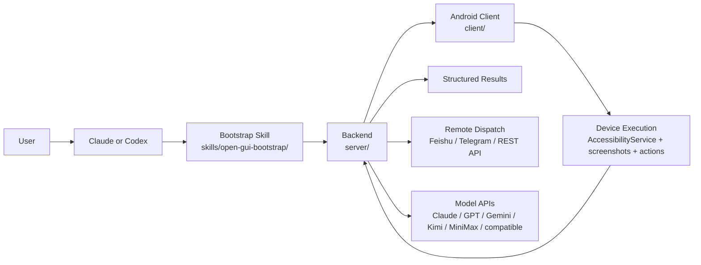

<p align="center">
  <strong>Language:</strong> <a href="./README.md">English</a> | <a href="./README.zh-CN.md">简体中文</a>
</p>

<p align="center">
  
</p>

<p align="center">
  <a href="./skills/open-gui-bootstrap/SKILL.md"></a>
  
  <a href="./docs/get-started.md"></a>
  <a href="./LICENSE"></a>
  
</p>

> Using Claude or Codex? Start with [`skills/open-gui-bootstrap/SKILL.md`](./skills/open-gui-bootstrap/SKILL.md), then tell it what you want in plain language.

## 1. Load the Bootstrap Skill First

If you are using **Claude or Codex**, do not start with manual setup steps.

Start with the built-in bootstrap skill first: [`skills/open-gui-bootstrap/SKILL.md`](./skills/open-gui-bootstrap/SKILL.md)

The intent is simple: let AI handle as much setup work as possible before asking you to touch anything.

The skill is designed to let AI handle:

- checkout validation
- dependency installation and verification
- backend bootstrap
- environment file generation
- model provider selection
- Android client build
- `adb` checks and port reverse when possible

You should only need to do physical-world steps:

- connect a phone or boot an emulator
- accept USB debugging authorization on-device
- enable AccessibilityService
- grant overlay and battery permissions
- provide model API keys when needed

If the current checkout is only a public docs snapshot, the skill stops early and says so directly instead of pretending the project can already be launched.

## 2. Understand the System



### Project Structure

```text
open-gui/
├── skills/open-gui-bootstrap/   # Claude/Codex bootstrap path
├── server/                      # backend orchestration, task lifecycle, APIs
├── client/                      # Android-native executor on the device
└── docs/                        # manual setup and supporting docs
```

The public repository may expose docs and skill assets before the full runnable tree is published. The bootstrap skill is the intended first check because it can tell you whether your checkout is ready to run.

## 3. Tell It What You Want

### Run it

```text
Read ./skills/open-gui-bootstrap/SKILL.md and help me run OpenGUI. Only ask me for phone-side actions.
```

### Use Claude

```text
Read ./skills/open-gui-bootstrap/SKILL.md and use Claude to bootstrap OpenGUI for me.
```

### Use GPT + Gemini

```text
Read ./skills/open-gui-bootstrap/SKILL.md and set up OpenGUI with GPT for planning and Gemini for vision.
```

### Use my own APIs

```text
Read ./skills/open-gui-bootstrap/SKILL.md and use my existing model APIs to get OpenGUI working.
```

## What OpenGUI Is

OpenGUI is an Android-native operator stack for running AI tasks on real mobile devices.

It brings together an Android-native execution client, backend task orchestration, and remote task dispatch so mobile tasks can be triggered, executed, reviewed, and returned as structured results.

You can start it with **Claude or Codex** and let AI handle most of the terminal-side setup, bootstrapping, dependency checks, client build, and `adb` wiring.

Built for repeatable mobile workflows, not just one-off phone-agent demos.

Originally built for internal mobile automation, OpenGUI is now being opened up for broader developer, research, and team use.

## Bring Your Own Model APIs

OpenGUI is not tied to a single model vendor.

You can plug in the APIs you already use for planning, reasoning, and vision, including:

- Claude
- GPT
- Gemini
- Kimi
- MiniMax
- other OpenAI-compatible or custom-compatible endpoints

This matters for real deployments because teams usually want to choose models based on:

- cost
- latency
- availability
- region
- task quality
- internal compliance constraints

## Why It Feels Different

The key difference is not only that OpenGUI can understand the screen. The bigger difference is that the execution system is filled in end to end.

It behaves more like a real operator stack than a standalone phone-agent experiment:

- **Android-native executor on the device**
- **Backend task orchestration and lifecycle management**
- **Remote entry points through Feishu, Telegram, and API**
- **Structured result handoff back to external systems**

That combination makes it better suited for repeatable workflows, not just local experiments.

## OpenGUI vs Typical Phone-Agent Frameworks

| Dimension | Typical phone-agent framework | OpenGUI |
|---|---|---|
| **Control path** | Usually driven by a laptop-side ADB loop | Android-native client executes actions through AccessibilityService |
| **System shape** | Agent loop plus model calls | Backend plus Android client plus task lifecycle |
| **Task entry** | Often local CLI or scripts | Feishu, Telegram, and REST API dispatch |
| **Execution mode** | Best for local experiments and debugging | Better for remote operation and repeatable internal workflows |
| **Output** | Mostly execution traces | Structured task results that can be consumed by other systems |

## At a Glance

| Area | What OpenGUI does |
|---|---|
| **Android-native execution** | Runs a persistent Android client instead of relying only on a laptop bridge |
| **Vision-first execution** | Understands app state from screenshots instead of hardcoded selectors |
| **Multi-step task planning** | Breaks goals into sub-tasks, executes, reviews, and retries |
| **Backend orchestration** | Tracks task state, execution flow, and result handoff on the server |
| **Remote task dispatch** | Accepts tasks from Feishu, Telegram, or REST API |
| **Bring your own models** | Works with your preferred model APIs instead of forcing one provider |

## Typical Use Cases

- Search Weibo for AI news and summarize the top results
- Open X and collect recent posts for a topic
- Execute repetitive mobile workflows on Android devices
- Trigger Android tasks remotely from Feishu or Telegram
- Prototype internal AI operators without building per-app adapters

## Manual Setup

If you prefer the manual path, use the setup guide instead of the main README:

- [docs/get-started.md](./docs/get-started.md)

## Current Scope and Limitations

OpenGUI is useful today, but it should be evaluated as an evolving open-source mobile operator framework, not as a fully polished end-user product.

Current constraints:

- Android is the active client target in this repository
- some backend modules are intentionally stubbed in the public release
- production deployment, observability, and multi-device orchestration are still evolving
- reliability depends on UI complexity, model quality, and device permission stability
- some docs and surfaces still reflect the transition from an internal system to an open-source release

If you are adopting OpenGUI internally, expect additional engineering work around deployment, guardrails, evaluation, and task-specific tuning.

## Documentation

- [skills/open-gui-bootstrap/SKILL.md](./skills/open-gui-bootstrap/SKILL.md)
- [PUBLIC_RELEASE_PLAN.md](./PUBLIC_RELEASE_PLAN.md)
- [docs/get-started.md](./docs/get-started.md)
- [CONTRIBUTING.md](./CONTRIBUTING.md)
- [SECURITY.md](./SECURITY.md)
- [CODE_OF_CONDUCT.md](./CODE_OF_CONDUCT.md)
- [CLAUDE.md](./CLAUDE.md)

## Community / Support

If OpenGUI is useful to you, the most helpful ways to support it are:

- star the repository
- open issues for bugs and feature requests
- share real use cases and deployment feedback
- contribute docs, integrations, and fixes
- introduce the project to teams building mobile AI agents

For a project moving from internal infrastructure toward a public framework, real usage feedback is especially valuable because it directly shapes what should become public-grade next.

## License

OpenGUI is licensed under the Apache 2.0 License.

See [LICENSE](./LICENSE).