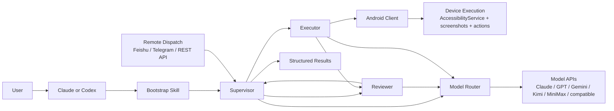

<p align="center">
  <strong>Language:</strong> <a href="./README.md">English</a> | <a href="./README.zh-CN.md">简体中文</a>
</p>

<p align="center">
  
</p>

<p align="center">
  <a href="./skills/open-gui-bootstrap/SKILL.md"></a>
  
  
  
  <a href="./docs/get-started.md"></a>
</p>

> Using Claude or Codex? Start with [`skills/open-gui-bootstrap/SKILL.md`](./skills/open-gui-bootstrap/SKILL.md), describe the goal in plain language, and let the model handle setup unless it needs phone-side actions or secrets.

## Start with the Bootstrap Skill

OpenGUI is meant to be started as a **plain-language bootstrap flow**.

If you are using **Claude or Codex**, begin with [`skills/open-gui-bootstrap/SKILL.md`](./skills/open-gui-bootstrap/SKILL.md). The model should read the skill, interpret your goal, and handle most of the setup work directly.

That includes:

- checkout validation
- backend bootstrap
- Android client build
- model routing and provider selection
- `adb` checks and port reverse when possible
- stopping early if the checkout is docs-only or incomplete

You should only be interrupted for:

- connecting a phone or booting an emulator
- approving USB debugging on-device
- enabling AccessibilityService
- granting overlay or battery permissions
- providing API keys or secrets

### Run it

```text
Read ./skills/open-gui-bootstrap/SKILL.md and help me run OpenGUI. Only ask me for phone-side actions.
```

### Use Claude

```text
Read ./skills/open-gui-bootstrap/SKILL.md and use Claude to bootstrap OpenGUI for me.
```

### Use GPT + Gemini

```text
Read ./skills/open-gui-bootstrap/SKILL.md and set up OpenGUI with GPT for supervision and Gemini for vision and review.
```

### Use my own APIs

```text
Read ./skills/open-gui-bootstrap/SKILL.md and use my existing model APIs to get OpenGUI working.
```

## The System



### Core Roles

- **Supervisor**: owns task state, decides next steps, coordinates retries, and keeps long-running workflows moving.
- **Executor**: drives actions on the Android side and advances the task against real device state.
- **Reviewer**: checks outcomes, detects drift or failure, and sends the task back for retry or continuation.
- **Model Router**: treats model providers as routed components inside the system.
- **Android Client**: gives the system a persistent device-side executor and keeps execution close to the device state.

## Why OpenGUI Is Different

OpenGUI uses a **multi-role mobile operator system** built for long-running, recoverable, repeatable workflows.

What matters here is the system shape:

- `Supervisor / Executor / Reviewer` gives the system internal role separation.
- model APIs are routed into the system as components, so the architecture can support different vendors and model roles.
- Android execution happens through a persistent client on the device, with backend coordination around it.
- remote dispatch and structured results make it usable as an operator platform with clear system boundaries.

| Dimension | Typical phone-agent product | OpenGUI |
|---|---|---|
| **System design** | Single agent loop around one primary model | Multi-role system with Supervisor, Executor, and Reviewer |
| **Model strategy** | One dominant model drives most decisions | Models are routed as components for supervision, execution support, and review |
| **Task duration** | Best suited for short interactive runs | Built for recoverable workflows, including 12-hour tasks |
| **Control path** | Often laptop-side phone control | Android-native client plus backend orchestration |
| **Operational shape** | Local demo or debugging tool | Remote-dispatch operator platform with structured results |

## Built for 12-hour tasks

OpenGUI is designed for tasks that may run for hours, including 12-hour tasks and other long-running mobile workflows.

What matters in a 12-hour task is system coherence while the environment changes.

OpenGUI is positioned for that kind of workload:

- **Supervisor** keeps task state and continuation logic intact over time.
- **Executor** keeps work moving on the device through a persistent execution path.
- **Reviewer** checks outcomes and can trigger retry, recovery, or continuation when the UI or environment changes.
- **Model routing** lets the system use the right provider for each role, with different providers assigned where that helps quality or stability.

This is the competitive point: OpenGUI is meant for repeatable mobile operations that can stay alive well beyond the short-session behavior of many comparable systems.

## What OpenGUI Is

OpenGUI is an Android-native operator stack for running AI tasks on real mobile devices.

It brings together an Android-native execution client, backend orchestration, and remote task dispatch so mobile tasks can be triggered, executed, reviewed, and returned as structured results.

Originally built for internal mobile automation, OpenGUI is now being opened up for broader developer, research, and team use.

## Typical Use Cases

- Search Weibo for AI news and summarize the top results
- Open X and collect recent posts for a topic
- Execute repetitive mobile workflows on Android devices
- Trigger Android tasks remotely from Feishu or Telegram
- Prototype internal AI operators without building per-app adapters
- Run long-lived mobile workflows that need supervision, review, and recovery over many hours

## Manual Setup

If you prefer the manual path, use the setup guide:

- [docs/get-started.md](./docs/get-started.md)

## Current Scope and Limitations

OpenGUI is useful today, but it should be evaluated as an evolving open-source mobile operator framework. It is still maturing toward a more polished end-user product.

Current constraints:

- Android is the active client target in this repository
- some backend modules are intentionally stubbed in the public release
- production deployment, observability, and multi-device orchestration are still evolving
- reliability depends on UI complexity, model quality, and device permission stability
- some docs and surfaces still reflect the transition from an internal system to an open-source release

If you are adopting OpenGUI internally, expect additional engineering work around deployment, guardrails, evaluation, and task-specific tuning.

## Documentation

- [skills/open-gui-bootstrap/SKILL.md](./skills/open-gui-bootstrap/SKILL.md)
- [PUBLIC_RELEASE_PLAN.md](./PUBLIC_RELEASE_PLAN.md)
- [docs/get-started.md](./docs/get-started.md)
- [CONTRIBUTING.md](./CONTRIBUTING.md)
- [SECURITY.md](./SECURITY.md)
- [CODE_OF_CONDUCT.md](./CODE_OF_CONDUCT.md)
- [CLAUDE.md](./CLAUDE.md)

## Community / Support

If OpenGUI is useful to you, the most helpful ways to support it are:

- star the repository
- open issues for bugs and feature requests
- share real use cases and deployment feedback
- contribute docs, integrations, and fixes
- introduce the project to teams building mobile AI agents

For a project moving from internal infrastructure toward a public framework, real usage feedback is especially valuable because it directly shapes what should become public-grade next.

## License

OpenGUI is licensed under the Apache 2.0 License.

See [LICENSE](./LICENSE).