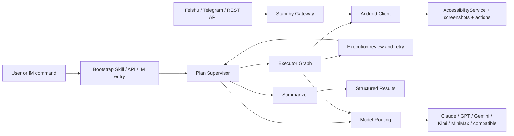

<p align="center">
  <strong>Language:</strong> <a href="./README.md">English</a> | <a href="./README.zh-CN.md">简体中文</a>
</p>

<p align="center">
  
</p>

<p align="center">
  <a href="./skills/open-gui-bootstrap/SKILL.md"></a>
  
  
  
  <a href="./docs/get-started.md"></a>
</p>

## What OpenGUI Is

OpenGUI lets AI operate real Android phones.

This repository now ships the runnable pieces: a NestJS backend, a LangGraph-based agent graph, an Android client, standby and execution WebSocket paths, and a bootstrap skill for Claude or Codex.

The backend owns task orchestration and remote dispatch. The Android client stays close to the device, executes actions through AccessibilityService, captures screenshots, and keeps a standby connection open for remote task delivery.

## Built for 12-hour tasks

OpenGUI is designed for long-running mobile workflows, including tasks that may stay alive for many hours.

The codebase already reflects that shape:

- **Plan Supervisor** keeps the task list and continuation state moving through the graph.
- **Executor Graph** runs the screenshot, vision, action, and call-user loop on top of the current device state.
- **Summarizer** closes the run with a structured result.
- **Standby dispatch** keeps devices available for remote task delivery through Feishu, Telegram, or REST-triggered flows.
- **Model routing** separates Claude-style planning from the VLM path used by the executor.

That system shape is what makes long tasks viable. The graph can keep state, recover from UI drift, route different model roles, and continue after user hand-offs.

## Why OpenGUI Is Different

OpenGUI is built as a mobile operator system with explicit orchestration layers.

The source code currently exposes these pieces:

- `server/apps/backend/src/modules/graph-agent/graph/mobile-agent.graph.ts` for the main graph
- `server/apps/backend/src/modules/graph-agent/graph/executor.graph.ts` for the device-side execution loop
- `server/apps/backend/src/common/ws/standby.gateway.ts` for standby device dispatch
- `client/core_network/.../StandbySocketManager.kt` for persistent device standby connections
- `client/core_accessibility/.../GestureService.kt` for Android-side action execution

| Dimension | Typical phone-agent demo | OpenGUI |
|---|---|---|
| **Execution model** | Short interactive loop | Main graph plus executor subgraph |
| **Task state** | Usually local and session-bound | Task state managed in the backend graph |
| **Device path** | Often laptop-driven control | Android client with standby and execution sockets |
| **Model usage** | One model does most of the work | Planning and VLM paths can be split across providers |
| **Remote operation** | Optional add-on | Feishu, Telegram, REST API, and standby dispatch are built into the backend |

## Typical Use Cases

- Search Weibo for AI news and summarize the top results
- Open X and collect recent posts for a topic
- Execute repetitive mobile workflows on Android devices
- Trigger Android tasks remotely from Feishu or Telegram
- Run long mobile workflows that need state, review, and recovery over many hours

## Start with the Bootstrap Skill

If you are using Claude or Codex, start with [`skills/open-gui-bootstrap/SKILL.md`](./skills/open-gui-bootstrap/SKILL.md).

The skill should handle the concrete install path that exists in this repository:

- run `server/start.sh`
- generate `server/apps/backend/.env` from `.env.example` on first run
- ask only for missing keys such as `CLAUDE_API_KEY` and `VLM_API_KEY`
- start PostgreSQL and Redis in Docker
- generate Prisma client, push schema, and seed backend data
- run `client/start.sh`
- use `adb reverse tcp:7777 tcp:7777`, build the APK, install it, and launch the app when a device is connected

The user should only need to step in for phone-side actions and secrets:

- connect a phone or boot an emulator
- approve USB debugging
- enable AccessibilityService
- grant overlay or battery permissions
- provide API keys or bot credentials

### Run it

```text
Read ./skills/open-gui-bootstrap/SKILL.md and help me run OpenGUI. Only ask me for phone-side actions.
```

### Use Claude

```text
Read ./skills/open-gui-bootstrap/SKILL.md and use Claude to bootstrap OpenGUI for me.
```

### Use GPT + Gemini

```text
Read ./skills/open-gui-bootstrap/SKILL.md and set up OpenGUI with GPT for planning and Gemini for vision.
```

### Use my own APIs

```text
Read ./skills/open-gui-bootstrap/SKILL.md and use my existing model APIs to get OpenGUI working.
```

## Manual Setup

Use the real setup docs and scripts in this repository:

- [docs/get-started.md](./docs/get-started.md)
- [server/start.sh](./server/start.sh)
- [client/start.sh](./client/start.sh)
- [server/apps/backend/README.md](./server/apps/backend/README.md)
- [client/README.md](./client/README.md)

## The System



### Core Runtime Pieces

- **Backend graph**: `server/apps/backend/src/modules/graph-agent/graph/`
- **Task APIs**: `server/apps/backend/src/modules/task/task.controller.ts`
- **Standby dispatch**: `server/apps/backend/src/common/ws/standby.gateway.ts`
- **Android standby connection**: `client/core_network/src/main/java/com/coremate/opengui/network/websocket/StandbySocketManager.kt`
- **Android execution path**: `client/core_accessibility/src/main/java/com/coremate/opengui/accessibility/GestureService.kt`

## Current Scope and Limitations

OpenGUI is already runnable from this repository, but it is still evolving as an open-source mobile operator framework.

Current constraints:

- Android is the active client target in this repository
- some backend modules remain stubs in the public release, such as `credits`, `knowledge`, and `tos`
- production deployment, observability, and multi-device orchestration are still moving forward
- runtime quality still depends on app UI complexity, model quality, and device permission stability
- there are two Chinese README files in the repo today; `README.zh-CN.md` is the current one

One important open-source behavior is already in the Android app: `SplashActivity` bypasses login and opens `HomeActivity` directly. For local runs, the backend task APIs also default to `userId = 1`, so the old OTP-first path is no longer the primary getting-started flow.

## Documentation

- [skills/open-gui-bootstrap/SKILL.md](./skills/open-gui-bootstrap/SKILL.md)
- [docs/get-started.md](./docs/get-started.md)
- [server/apps/backend/README.md](./server/apps/backend/README.md)
- [client/README.md](./client/README.md)
- [PUBLIC_RELEASE_PLAN.md](./PUBLIC_RELEASE_PLAN.md)
- [CONTRIBUTING.md](./CONTRIBUTING.md)
- [SECURITY.md](./SECURITY.md)
- [CLAUDE.md](./CLAUDE.md)

## Community / Support

If OpenGUI is useful to you, the most helpful ways to support it are:

- star the repository
- open issues for bugs and feature requests
- share real use cases and deployment feedback
- contribute docs, integrations, and fixes
- introduce the project to teams building mobile AI agents

## License

OpenGUI is licensed under the Apache 2.0 License.

See [LICENSE](./LICENSE).