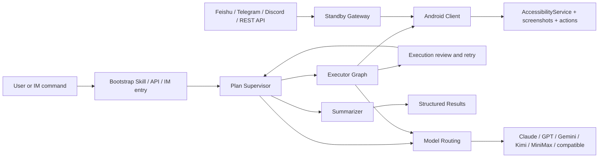

<p align="center">
  <strong>Language:</strong> <a href="./README.md">English</a> | <a href="./README.zh-CN.md">简体中文</a> | <a href="./README.ja-JP.md">日本語</a>
</p>

<p align="center">
  
</p>

<p align="center">
  <a href="https://trendshift.io/repositories/183339"></a>
</p>

<p align="center">
  <a href="#use-opengui-in-workbuddy"></a>
  <a href="#use-opengui-in-deepseek-harness"></a>
  <a href="./skills/open-gui-bootstrap/SKILL.md"></a>
  
  <a href="./docs/get-started.md"></a>
</p>

<p align="center">
  <strong>A mobile GUI agent framework for Android.</strong>
</p>

<p align="center">
  OpenGUI helps AI agents see, understand, and operate Android app interfaces on real devices.
</p>

<p align="center">
  <strong>Use OpenGUI in WorkBuddy or DeepSeek Harness.</strong><br>
  Install the plugin, connect your phone, and describe your task. No full backend deployment is required.
</p>

## Features at a Glance

OpenGUI uses real screenshots to understand apps and carry out phone operations and testing tasks from natural-language instructions.

- **Phone operations**: open apps, tap, swipe, type, navigate back, and move between screens to complete multi-step workflows.
- **App testing**: check features and workflows, record issues with reproduction steps and screenshots, and summarize results.
- **Content and information**: read screen content, organize information, fill forms, and prepare social media drafts.
- **Visible execution**: use the WorkBuddy workbench to view the phone screen, task steps, and reports, or take over and stop a task.
- **Host integration**: use OpenGUI in WorkBuddy or DeepSeek Harness; the DSH plugin also supports managed browser operations.

## Common Commands

After installation and authorization, enter these instructions in the corresponding host's chat. Replace `[placeholders]` with your task details.

| Purpose | Host | Example input |
|---|---|---|
| Open OpenGUI | WorkBuddy | `/opengui` |
| Check connected devices | WorkBuddy | `/opengui List connected devices without operating a phone.` |
| Operate a phone | WorkBuddy | `/opengui Open Settings, then return to the home screen. Stop after confirming it is visible.` |
| Test an app | WorkBuddy | `/opengui Test [feature or workflow] in [app/page]. Record issues, steps, and screenshots. Stop at [end condition].` |
| Prepare a Xiaohongshu draft | WorkBuddy | `/opengui Prepare a Xiaohongshu image-and-text draft about [topic]. Stop before publishing.` |
| Run a task in DSH | DeepSeek Harness | `@OpenGUI Open Settings and report the Android version` |

## Use OpenGUI in WorkBuddy

Supported on **macOS (Apple Silicon / Intel) with WorkBuddy 5.5.3 or later**. The current public release is [0.4.0, a public-testing prerelease](https://github.com/Core-Mate/OpenGUI/releases/tag/opengui-workbuddy-v0.4.0). Download and run the installer on your Mac, then authorize OpenGUI in WorkBuddy.

**Step 1. Install with a Terminal command**

Open macOS Terminal, paste this command, and run it:

```sh
cd "$HOME" && curl -fsSL https://raw.githubusercontent.com/Core-Mate/OpenGUI/main/workbuddy-plugin/install.sh | bash
```

This downloads and runs the installer without saving it manually first. The script verifies the subsequent installation files, prepares the runtime, and configures OpenGUI. WorkBuddy may stay open during installation; no phone is required yet.

**After successful installation, the authorization guide opens automatically in your browser. Follow its instructions to authorize the Skill and connector.** To open it manually, download the HTML from the [authorization guide file page](./workbuddy-plugin/resources/OpenGUI-授权指南.html), then open the downloaded file in your browser.

You can also [download install.sh separately](https://raw.githubusercontent.com/Core-Mate/OpenGUI/main/workbuddy-plugin/install.sh) and run `bash /actual/path/install.sh` in Terminal.

**Step 2. Authorize the Skill and connector**

In WorkBuddy, open **Experts · Skills · Connectors → Skills**, find OpenGUI, and complete authorization. Then open **Connectors**, find OpenGUI, and authorize it as well.

**Both the Skill and connector require authorization.**


If OpenGUI is not listed under Connectors, check **Custom connectors** for its MCP service. Only if OpenGUI is missing or the new configuration has not loaded, finish other tasks, quit WorkBuddy with ⌘Q, and reopen it. If the authorization page did not open automatically, open the `AUTHORIZATION_GUIDE` path printed in Terminal; no reinstallation is needed.

**Step 3. Verify the connection and start using OpenGUI**

Enable USB debugging on your Android phone, connect it to your computer, and approve USB debugging on the phone. Enter /opengui, then enter the instructions you want the phone to execute to control it.

Try it: Post on Xiaohongshu

```text
/opengui Prepare a Xiaohongshu image-and-text draft about [topic] using [materials]. Stop before publishing.
```

Try it: Vibe Testing

```text
/opengui Help me test [feature or workflow] in [app/page], focusing on [issues to check]. If you find any problems, record the steps and screenshots. Stop when [end condition] is reached.
```

## Use OpenGUI in DeepSeek Harness

The shortest path on macOS is to let Codex run the stable installer Skill from `main`. Each run resolves the latest stable OpenGUI plugin release, while an explicit version remains available for rollback. It requires Node.js 22.19+ or 24+ and installs the compatible DSH version automatically. Paste this as one prompt:

```text
Install and run the OpenGUI installer Skill from https://github.com/Core-Mate/OpenGUI/tree/main/deepseek-harness-plugin/skills/opengui-coremate-install for my DSH web profile. Install the latest stable release. Proceed autonomously, and only pause when I need to authorize or select a phone, add or select a DSH workspace, or provide fallback visual-model credentials.
```

The Skill downloads the public release package and checksum, verifies SHA-256, installs only the OpenGUI plugin, starts DSH when needed, and opens DSH. It preserves unrelated DSH plugins and settings. The installer reports whether it reloaded a managed DSH or whether you need to quit an existing process and rerun it. For Linux or Windows, use the [manual package guide](./deepseek-harness-plugin/README.md#1-download-the-release-package).

Supported DSH versions are defined in the [installer compatibility list](./deepseek-harness-plugin/skills/opengui-coremate-install/dsh-compatibility.json). The default is `0.1.1-rc.2`; use `--dsh-version VERSION` to select a listed version. The installer preserves other plugins, workspaces, model settings, and credentials. See the [plugin installation guide](./deepseek-harness-plugin/README.md#requirements-and-support) for version changes and rollback constraints.

After installation, add or select a DSH workspace, connect and select an authorized Android phone, then send:

```text
@OpenGUI Open Settings and report the Android version
```

The plugin adds phone and browser operation to DSH without requiring the full OpenGUI backend stack. The current source implementation admits one OpenGUI task per DSH session and separate tabs on non-conflicting phone sets; the managed browser remains globally serial. This source behavior is not a release claim. See more [use cases](./deepseek-harness-plugin/docs/use-cases.md) or download the [v0.1.13 release package](https://github.com/Core-Mate/OpenGUI/releases/tag/dsh-coremate-mobile-v0.1.13).

GUI execution requires a model with image input and tool calling. DSH uses the current session model by default; configure a fallback visual model when needed, following the [plugin guide](./deepseek-harness-plugin/README.md). Evaluate execution quality, latency, and actual costs on your own tasks.

## Run the Full OpenGUI Stack

Use the full stack to self-host the backend and Android client or dispatch tasks through Feishu, Telegram, Discord, or REST APIs. WorkBuddy and DSH plugin users do not need this deployment.

Open Claude Code, Codex, or OpenCode in the repository root and send:

```text
Read ./skills/open-gui-bootstrap/SKILL.md and help me run OpenGUI. Only ask me for phone-side actions.
```

The full-stack Android client requires Android 11 (API 30) or later, USB debugging, AccessibilityService, overlay permission, and a battery optimization exemption. See the [deployment guide](./docs/get-started.md) and [Android permission guide](./docs/android-permissions.md) for model configuration, manual startup, and phone authorization.

After deployment, run the CLI from the `server` directory:

```bash
pnpm opengui -- devices --json
pnpm opengui -- do "Observe the current Android screen, summarize what you see, and stop" --json
pnpm opengui -- status <executionId> --json
pnpm opengui -- cancel <executionId> --json
```

`do` returns an `executionId` asynchronously. Use it with `status` to check progress or `cancel` to stop the task. See the [CLI and API guide](./docs/codex-remote-control.md) and [Discord setup](./docs/DISCORD.md) for remote integration.

## Recent Updates

- `[2026.10.8]` Published the [WorkBuddy 0.4.0 public-testing prerelease](https://github.com/Core-Mate/OpenGUI/releases/tag/opengui-workbuddy-v0.4.0), with a Terminal installer and an authorization guide that opens after installation.
- `[2026.9.1]` Published the [DSH 0.1.13 plugin release](https://github.com/Core-Mate/OpenGUI/releases/tag/dsh-coremate-mobile-v0.1.13).
- `[2026.5.16]` Added [Codex / Claude Code remote control](./docs/codex-remote-control.md) with a local REST API, `pnpm opengui -- ...` CLI, and the [`open-gui-remote-control`](./skills/open-gui-remote-control/SKILL.md) Skill for dispatching Android app tasks from coding agents.
- `[2026.5.12]` Added a troubleshooting guide for backend connection, Android permissions, model configuration, and local Redis/PostgreSQL conflicts.
- `[2026.5.9]` Added a [Discord IM channel](./docs/DISCORD.md) for remote Android task dispatch, including prefix commands, slash commands, allowlists, and guild-scoped command registration.
- `[2026.5.7]` Hardened local startup to avoid common PostgreSQL and Redis port conflicts during Docker-based backend setup.
- `[2026.5.1]` Improved backend onboarding with `.env.example`, startup checks, and graph-agent VLM environment configuration.

## Requirements and Limitations

| Setup | Computer and runtime | Android device preparation |
|---|---|---|
| WorkBuddy plugin | macOS (Apple Silicon / Intel), WorkBuddy 5.5.3 or later; the installer prepares a private runtime. | Enable and authorize USB debugging. Uses host-side ADB / scrcpy; no full backend or repository Android client is required. |
| DSH plugin | macOS, Linux x64, or Windows x64; see the [plugin guide](./deepseek-harness-plugin/README.md#requirements-and-support) for Node.js and DSH requirements. | Enable and authorize USB debugging, then select the device in DSH. No full backend or repository Android client is required. |
| Full stack | Local backend and build tools; see the [deployment guide](./docs/get-started.md). | Android 11 or later, with the client's accessibility, overlay, and battery permissions. |

- Some phones need an additional vendor-specific USB input permission. Follow the connection diagnostics on the phone.
- WorkBuddy uses its current conversation model; DSH session models and full-backend model settings are separate setup paths.
- Results depend on the model, app UI, network, and task length. Long-running tasks and device compatibility still need more real-world verification.
- WorkBuddy SMS sign-in uses the official CoreMate account service by default. No online model catalog is read. Task screenshots go to the current WorkBuddy model; local preview video is not uploaded frame by frame. See the [WorkBuddy guide](./workbuddy-plugin/README.md) and [DSH guide](./deepseek-harness-plugin/README.md) for their data flows.

## Roadmap

- Add more real app examples and test reports.
- Improve one-command local setup.
- Add more ready-to-run phone-use task templates.
- Improve execution recovery and failure reporting.
- Add benchmark tasks for Android GUI agent reliability.
- Expand docs for model configuration and cost-saving profiles.
- Launch a hosted OpenGUI Agent service for teams that want GUI operation without running the full stack themselves.

## The System

This diagram describes the full backend and Android client. WorkBuddy and DSH each use their own plugin runtime.


```mermaid
flowchart LR
    U["User or IM command"] --> BS["Bootstrap Skill / API / IM entry"]
    BS --> SP["Plan Supervisor"]

    SP --> EX["Executor Graph"]
    EX --> AC["Android Client"]
    AC --> GX["AccessibilityService + screenshots + actions"]
    EX --> RV["Execution review and retry"]
    RV --> SP

    SP --> SM["Summarizer"]
    SM --> SR["Structured Results"]

    RD["Feishu / Telegram / Discord / REST API"] --> ST["Standby Gateway"]
    ST --> AC

    SP --> MR["Model Routing"]
    MR --> MA["Claude / GPT / Gemini / Kimi / MiniMax / compatible"]
    EX --> MR
```

### Core Runtime Pieces

- **Backend graph**: `server/apps/backend/src/modules/graph-agent/graph/`
- **Task APIs**: `server/apps/backend/src/modules/task/task.controller.ts`
- **Standby dispatch**: `server/apps/backend/src/common/ws/standby.gateway.ts`
- **IM channel dispatch**: `server/apps/backend/src/modules/im-channel/`
- **Android standby connection**: `client/core_network/src/main/java/com/coremate/opengui/network/websocket/StandbySocketManager.kt`
- **Android execution path**: `client/core_accessibility/src/main/java/com/coremate/opengui/accessibility/GestureService.kt`

## Documentation

- [WorkBuddy installation verification and troubleshooting](./workbuddy-plugin/INSTALL.md)
- [WorkBuddy plugin guide](./workbuddy-plugin/README.md)
- [DeepSeek Harness plugin guide](./deepseek-harness-plugin/README.md)
- [skills/open-gui-bootstrap/SKILL.md](./skills/open-gui-bootstrap/SKILL.md)
- [docs/get-started.md](./docs/get-started.md)
- [server/apps/backend/README.md](./server/apps/backend/README.md)
- [docs/DISCORD.md](./docs/DISCORD.md)
- [client/README.md](./client/README.md)
- [CONTRIBUTING.md](./CONTRIBUTING.md)
- [SECURITY.md](./SECURITY.md)
- [CLAUDE.md](./CLAUDE.md)

## Community / Support

Join the [OpenGUI Discord community](https://discord.gg/pqHHw7XgJ3) to discuss GUI agent development, share real use cases, and get release updates. A verified WeChat community entry will be published here when it is ready.

Community members will also be able to apply for trial Agent credits when the hosted OpenGUI Agent service opens. Availability, eligibility, and validity will be announced with the service.

The most useful project feedback is:

- open issues for bugs and feature requests
- share real use cases and deployment feedback
- contribute docs, integrations, and fixes

## License

OpenGUI is source-available under the Business Source License 1.1 (BUSL-1.1).

You may copy, modify, distribute, and use the source for non-production purposes. Production use, commercial use, hosted services, and integration into commercial products require a separate commercial license from Core-Mate.

For this version:

- Change Date: 2030-04-29
- Change License: Apache License, Version 2.0

This is public source, but it is not OSI-approved open source until the Change Date.

See [LICENSE](./LICENSE).
