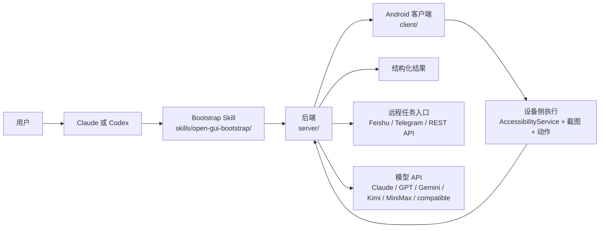

<p align="center">
  <strong>语言切换：</strong><a href="./README.md">English</a> | <a href="./README.zh-CN.md">简体中文</a>
</p>

<p align="center">
  
</p>

<p align="center">
  <a href="./skills/open-gui-bootstrap/SKILL.md"></a>
  
  <a href="./docs/get-started.md"></a>
  <a href="./LICENSE"></a>
  
</p>

> 在用 Claude 或 Codex？先从 [`skills/open-gui-bootstrap/SKILL.md`](./skills/open-gui-bootstrap/SKILL.md) 开始，再直接用自然语言告诉它你要做什么。

## 1. 先用 Bootstrap Skill

如果你在使用 **Claude 或 Codex**，不要先从手动配置环境开始。

优先从仓库内置的 bootstrap skill 开始：[`skills/open-gui-bootstrap/SKILL.md`](./skills/open-gui-bootstrap/SKILL.md)

目标很简单：在让你动手之前，先让 AI 尽可能多地把 setup 工作做掉。

这个 skill 设计出来就是为了让 AI 处理：

- checkout 可运行性判断
- 依赖安装和校验
- 后端 bootstrap
- 环境文件生成
- 模型提供方选择
- Android 客户端构建
- 在可能情况下处理 `adb` 检查和端口反向代理

你只需要处理物理世界相关步骤：

- 连接手机或启动模拟器
- 在设备上点选 USB 调试授权
- 开启 AccessibilityService
- 授予悬浮窗和电池权限
- 在需要时提供模型 API Key

如果当前 checkout 只是公开文档快照，skill 会直接说明无法启动，而不会假装项目已经能跑起来。

## 2. 先看清系统结构



### 项目结构

```text
open-gui/
├── skills/open-gui-bootstrap/   # Claude/Codex 的 bootstrap 路径
├── server/                      # 后端编排、任务生命周期、API
├── client/                      # 设备侧 Android 原生执行器
└── docs/                        # 手动安装和补充文档
```

公开仓库可能会先放出 docs 和 skill 资产，再逐步公开完整可运行代码树。bootstrap skill 是推荐的第一步，因为它可以先判断你当前 checkout 到底能不能跑。

## 3. 再直接描述你的目标

### 直接运行

```text
先读 ./skills/open-gui-bootstrap/SKILL.md，然后帮我把 OpenGUI 跑起来，只在必须时告诉我手机上要做什么。
```

### 使用 Claude

```text
先读 ./skills/open-gui-bootstrap/SKILL.md，然后用 Claude 帮我 bootstrap OpenGUI。
```

### 使用 GPT + Gemini

```text
先读 ./skills/open-gui-bootstrap/SKILL.md，然后帮我用 GPT 做规划、Gemini 做视觉，把 OpenGUI 配好。
```

### 使用我自己的 API

```text
先读 ./skills/open-gui-bootstrap/SKILL.md，然后用我现有的模型 API 把 OpenGUI 跑起来。
```

## OpenGUI 是什么

OpenGUI 是一套面向真实 Android 设备的 AI Operator Stack。

它把 Android 原生执行端、后端任务编排和远程任务下发整合进同一个系统，让移动任务可以被触发、执行、复核，并最终以结构化结果返回。

你可以直接用 **Claude 或 Codex** 来启动它，让 AI 处理大部分终端侧准备工作，包括 bootstrap、依赖检查、客户端构建和 `adb` 连线。

它面向的是可重复运行的移动工作流，而不只是一次性的手机 Agent Demo。

它最初来自内部移动自动化场景，现在正在逐步开放出来，供更多开发者、研究者和团队使用。

## 自带你的模型 API

OpenGUI 不绑定单一模型供应商。

你可以接入团队已经在使用的模型 API，用于规划、推理和视觉理解，包括：

- Claude
- GPT
- Gemini
- Kimi
- MiniMax
- 其他 OpenAI-compatible 或自定义兼容接口

这点对真实部署很重要，因为团队通常需要按这些维度自由选型：

- 成本
- 延迟
- 可用性
- 区域
- 任务效果
- 内部合规要求

## 为什么它看起来不一样

OpenGUI 的关键不只是“能看懂屏幕”，而是执行系统被补完整了。

它更像一套真实 operator stack，而不是单独的 phone-agent experiment：

- **设备侧 Android 原生执行器**
- **后端任务编排和生命周期管理**
- **飞书、Telegram、API 远程任务入口**
- **结构化结果回传给外部系统**

这几个部分放在一起，决定了它更适合可重复的工作流，而不只是本地实验。

## OpenGUI 和典型手机 Agent 框架的区别

| 维度 | 典型手机 Agent 框架 | OpenGUI |
|---|---|---|
| **控制链路** | 通常由电脑侧 ADB 调试循环驱动 | Android 原生客户端通过 AccessibilityService 执行动作 |
| **系统形态** | Agent loop 加模型调用 | 后端加 Android 客户端加任务生命周期 |
| **任务入口** | 多为本地 CLI 或脚本触发 | 支持飞书、Telegram、REST API 下发 |
| **执行方式** | 更适合本地实验和调试 | 更适合远程操作和可重复的内部工作流 |
| **输出结果** | 多为执行过程结果 | 可返回给外部系统的结构化任务结果 |

## 一眼看懂 OpenGUI

| 方向 | OpenGUI 提供什么 |
|---|---|
| **Android 原生执行** | 不是只依赖电脑侧桥接，而是运行常驻 Android 客户端 |
| **视觉优先执行** | 基于截图理解界面状态，而不是依赖写死的选择器 |
| **多步任务规划** | 把目标拆成子任务，执行、复核、重试 |
| **后端任务编排** | 在服务端管理任务状态、执行流程和结果回传 |
| **远程任务下发** | 支持通过飞书、Telegram 或 REST API 触发任务 |
| **模型自由接入** | 不强绑单一厂商，支持接入你自己的模型 API |

## 典型使用场景

- 搜索微博上的 AI 新闻并汇总前几条结果
- 打开 X 并采集某个主题的近期内容
- 在 Android 设备上执行重复性的移动工作流
- 从飞书或 Telegram 远程触发手机任务
- 在不构建单 App 适配器的前提下，原型化内部 AI Operator

## 手动安装

如果你更希望走手动安装路径，不要看主 README 里的长步骤，直接看安装文档：

- [docs/get-started.md](./docs/get-started.md)

## 当前范围与限制

OpenGUI 现在已经可用，但更准确的定位是：一个仍在持续演进的开源移动 operator framework，而不是已经完全产品化的终端产品。

目前需要注意的边界包括：

- 当前活跃客户端目标是 Android
- 后端有一部分模块在公开版本中仍然是 stub
- 生产级部署、可观测性和多设备编排还在演进中
- 实际稳定性依赖于 App UI 复杂度、模型质量和设备权限状态
- 某些文档和功能面还保留着从内部系统迁移为开源版本的痕迹

如果你准备在内部场景中采用 OpenGUI，通常还需要补齐部署、护栏、评估和任务定制这部分工程工作。

## Documentation

- [skills/open-gui-bootstrap/SKILL.md](./skills/open-gui-bootstrap/SKILL.md)
- [PUBLIC_RELEASE_PLAN.md](./PUBLIC_RELEASE_PLAN.md)
- [docs/get-started.md](./docs/get-started.md)
- [CONTRIBUTING.md](./CONTRIBUTING.md)
- [SECURITY.md](./SECURITY.md)
- [CODE_OF_CONDUCT.md](./CODE_OF_CONDUCT.md)
- [CLAUDE.md](./CLAUDE.md)

## Community / Support

如果 OpenGUI 对你有帮助，最有效的支持方式包括：

- 给仓库点 Star
- 提交 bug 和 feature request
- 分享真实使用场景和部署反馈
- 贡献文档、集成和修复
- 推荐给正在做移动 AI Agent 的团队

对于一个从内部基础设施逐步走向公开框架的项目来说，真实使用反馈尤其重要，因为它会直接影响接下来哪些能力最值得优先做成 public-grade。

## License

OpenGUI 采用 Apache 2.0 License。

详见 [LICENSE](./LICENSE).