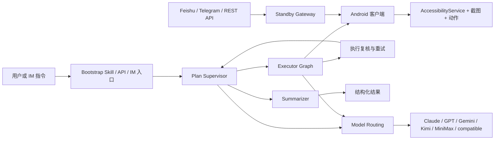

<p align="center">
  <strong>语言切换：</strong><a href="./README.md">English</a> | <a href="./README.zh-CN.md">简体中文</a>
</p>

<p align="center">
  
</p>

<p align="center">
  <a href="./skills/open-gui-bootstrap/SKILL.md"></a>
  
  
  
  <a href="./docs/get-started.md"></a>
</p>

## 你可以用 OpenGUI 做什么

OpenGUI 让 AI 操作真实的 Android 手机。

同一个仓库里，你可以直接做四类事情：

- **操作主流 Android App**：让 AI 在真实手机上执行 X、Reddit、Hacker News、Telegram、微信、微博、小红书等移动任务。
- **运行现成工作流**：仓库已经包含可直接启动的后端、Android 客户端、待命派发链路，以及部分预置任务能力。
- **让 Claude 或 Codex 帮你跑起来**：把 [`skills/open-gui-bootstrap/SKILL.md`](./skills/open-gui-bootstrap/SKILL.md) 交给模型，直接用自然语言描述目标，让它处理安装、构建、安装 APK 和本地排障。
- **把手机当成远程 worker 使用**：通过飞书、Telegram 或 REST API 下发任务，让设备保持待命，并从后端拿回结构化结果。

## 亮点

- **适合长时任务**：OpenGUI 面向长时移动工作流，任务可以持续运行数小时，并在过程中继续推进、复核和恢复。
- **任务能持续跑下去**：`Plan Supervisor` 维护任务列表和继续执行状态，`Executor Graph` 围绕当前设备状态运行截图、视觉分析、动作执行和 call-user 循环，`Summarizer` 在任务结束时输出结构化结果。
- **手机可以保持待命**：待命派发链路让设备可以通过飞书、Telegram 或 REST 入口接收远程任务。
- **模型可以按角色分工**：模型路由把规划侧和 VLM 执行侧拆开，便于按角色选择 provider。
- **整套系统围绕真实移动工作流组织**：graph、设备执行链路和模型分工已经在源码里落地。

## 为什么 OpenGUI 不一样

OpenGUI 采用的是一套分层清晰的移动 operator system。

当前源码里可以直接看到这些关键部分：

- `server/apps/backend/src/modules/graph-agent/graph/mobile-agent.graph.ts` 主图
- `server/apps/backend/src/modules/graph-agent/graph/executor.graph.ts` 设备执行子图
- `server/apps/backend/src/common/ws/standby.gateway.ts` 待命设备派发
- `client/core_network/.../StandbySocketManager.kt` 设备待命连接
- `client/core_accessibility/.../GestureService.kt` Android 侧动作执行

| 维度 | 典型手机 Agent Demo | OpenGUI |
|---|---|---|
| **执行模型** | 短时交互循环 | 主图 + executor 子图 |
| **任务状态** | 常常停留在本地会话里 | 任务状态由后端 graph 持有 |
| **设备链路** | 常见是电脑侧驱动手机 | Android 客户端自带待命与执行连接 |
| **模型使用** | 一个主模型承担大部分工作 | 规划和 VLM 执行可以拆给不同 provider |
| **远程运行** | 往往是附加能力 | 飞书、Telegram、REST API、待命派发已经在后端里 |

## 典型使用场景

- 打开 X 并采集某个主题的近期内容
- 在真实手机上阅读并总结 Reddit 或 Hacker News 帖子
- 从飞书或 Telegram 远程触发手机任务
- 在 Android 设备上执行重复性的移动工作流
- 运行需要状态管理、复核和恢复机制的长时移动工作流

## 怎么使用 OpenGUI

### 1. 用 Claude 或 Codex 帮你跑起来

优先从 [`skills/open-gui-bootstrap/SKILL.md`](./skills/open-gui-bootstrap/SKILL.md) 开始。

推荐流程很简单：

1. 把 skill 交给 Claude 或 Codex
2. 直接用自然语言描述目标
3. 让模型处理后端 bootstrap、APK 构建、安装和本地排障

模型只应该在这些事情上打断你：

- 连接手机或启动模拟器
- 允许 USB 调试
- 开启 AccessibilityService
- 授予悬浮窗或电池权限
- 提供 API Key 或机器人密钥

推荐配置：

#### 高配版

如果你优先要效果，可以把规划、监督、复核和视觉分析都放到最新的 Claude Opus 模型族上。

这条路径最省心，整体质量也最高，同时成本最高。

#### 省钱混用版

如果你优先控制成本，建议把 **Planner**、**Supervisor** 这类文本角色放到 **千问 3.6 Plus**，把 **VLM** 这一侧放到 **豆包 Pro**。

在很多任务里，这种混用方式还能保持整体系统结构，同时把模型成本大致降到全量 Opus 方案的 **1/10 到 1/15**，实际比例会受到任务时长、截图数量和 token 结构影响。

推荐说法：

#### 直接运行

```text
读一下 ./skills/open-gui-bootstrap/SKILL.md，然后帮我把 OpenGUI 跑起来，只在必须时告诉我手机上要做什么。
```

#### 全部使用 Claude Opus

```text
读一下 ./skills/open-gui-bootstrap/SKILL.md，然后用最新的 Claude Opus 模型族来配置 OpenGUI，把规划、监督、复核和视觉分析都放进去。
```

#### 用千问 + 豆包省钱

```text
读一下 ./skills/open-gui-bootstrap/SKILL.md，然后帮我把 OpenGUI 配成：Planner 和 Supervisor 用千问 3.6 Plus，VLM 执行侧用豆包 Pro。
```

#### 使用我自己的 API

```text
读一下 ./skills/open-gui-bootstrap/SKILL.md，然后用我现有的模型 API 把 OpenGUI 跑起来。
```

### 2. 手动安装

直接使用仓库里的脚本：

```bash
cd server
./start.sh
```

```bash
cd client
./start.sh
```

参考文档：

- [docs/get-started.md](./docs/get-started.md)
- [server/start.sh](./server/start.sh)
- [client/start.sh](./client/start.sh)
- [server/apps/backend/README.md](./server/apps/backend/README.md)
- [client/README.md](./client/README.md)

## 系统结构



### 运行时核心部件

- **后端 graph**：`server/apps/backend/src/modules/graph-agent/graph/`
- **任务 API**：`server/apps/backend/src/modules/task/task.controller.ts`
- **待命派发**：`server/apps/backend/src/common/ws/standby.gateway.ts`
- **设备待命连接**：`client/core_network/src/main/java/com/coremate/opengui/network/websocket/StandbySocketManager.kt`
- **Android 执行链路**：`client/core_accessibility/src/main/java/com/coremate/opengui/accessibility/GestureService.kt`

## 当前范围与限制

OpenGUI 现在已经可以直接从这个仓库跑起来，但它仍然处在持续演进阶段，定位更接近开源移动 operator framework。

目前需要注意的边界包括：

- 当前活跃客户端目标是 Android
- 后端仍有一部分模块在公开版本中是 stub，例如 `credits`、`knowledge`、`tos`
- 生产级部署、可观测性和多设备编排还在继续完善
- 实际运行质量仍然依赖 App UI 复杂度、模型质量和设备权限状态
- 仓库里现在有两个中文 README，当前版本以 `README.zh-CN.md` 为准

还有一个和旧文档不同的点已经在代码里落地：`SplashActivity` 在开源版本里直接跳转到 `HomeActivity`，不再把登录放在首跑入口。后端任务控制器也默认使用 `userId = 1`，所以本地启动路径不再依赖早期的 OTP 登录流程。

## Documentation

- [skills/open-gui-bootstrap/SKILL.md](./skills/open-gui-bootstrap/SKILL.md)
- [docs/get-started.md](./docs/get-started.md)
- [server/apps/backend/README.md](./server/apps/backend/README.md)
- [client/README.md](./client/README.md)
- [PUBLIC_RELEASE_PLAN.md](./PUBLIC_RELEASE_PLAN.md)
- [CONTRIBUTING.md](./CONTRIBUTING.md)
- [SECURITY.md](./SECURITY.md)
- [CLAUDE.md](./CLAUDE.md)

## Community / Support

如果 OpenGUI 对你有帮助，最有效的支持方式包括：

- 给仓库点 Star
- 提交 bug 和 feature request
- 分享真实使用场景和部署反馈
- 贡献文档、集成和修复
- 推荐给正在做移动 AI Agent 的团队

## License

OpenGUI 采用 Apache 2.0 License。

详见 [LICENSE](./LICENSE)。
