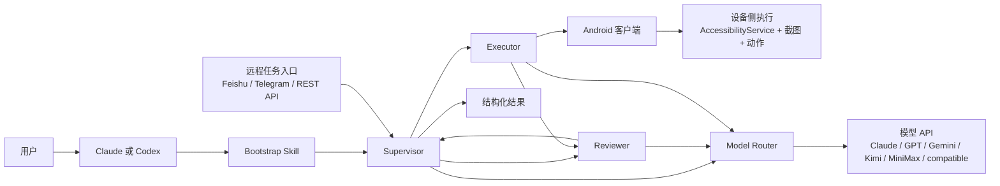

<p align="center">
  <strong>语言切换：</strong><a href="./README.md">English</a> | <a href="./README.zh-CN.md">简体中文</a>
</p>

<p align="center">
  
</p>

<p align="center">
  <a href="./skills/open-gui-bootstrap/SKILL.md"></a>
  </a>
  
  
  <a href="./docs/get-started.md"></a>
</p>

> 在用 Claude 或 Codex？先从 [`skills/open-gui-bootstrap/SKILL.md`](./skills/open-gui-bootstrap/SKILL.md) 开始，用自然语言直接描述目标，然后让模型处理 setup，除非它真的需要你去做手机侧动作或提供密钥。

## 先用 Bootstrap Skill，然后直接说目标

OpenGUI 的推荐启动方式是 **自然语言 bootstrap**，不是手动一步步配环境。

如果你在使用 **Claude 或 Codex**，优先从 [`skills/open-gui-bootstrap/SKILL.md`](./skills/open-gui-bootstrap/SKILL.md) 开始。模型应该先读这个 skill，再自己把你的目标翻译成可执行的 setup 和启动流程。

它应该替你处理：

- checkout 可运行性判断
- 后端 bootstrap
- Android 客户端构建
- 模型路由和 provider 选择
- 在可能情况下处理 `adb` 检查和端口反向代理
- 如果当前 checkout 只有 docs 或不完整，提前停止并说明原因

你只应该在这些事情上被打断：

- 连接手机或启动模拟器
- 在设备上允许 USB 调试
- 开启 AccessibilityService
- 授予悬浮窗或电池权限
- 提供 API Key 或其他密钥

### 直接运行

```text
先读 ./skills/open-gui-bootstrap/SKILL.md，然后帮我把 OpenGUI 跑起来，只在必须时告诉我手机上要做什么。
```

### 使用 Claude

```text
先读 ./skills/open-gui-bootstrap/SKILL.md，然后用 Claude 帮我 bootstrap OpenGUI。
```

### 使用 GPT + Gemini

```text
先读 ./skills/open-gui-bootstrap/SKILL.md，然后帮我用 GPT 做监督和规划，用 Gemini 做视觉和复核，把 OpenGUI 配好。
```

### 使用我自己的 API

```text
先读 ./skills/open-gui-bootstrap/SKILL.md，然后用我现有的模型 API 把 OpenGUI 跑起来。
```

## 系统结构



### 核心角色

- **Supervisor**：持有任务状态，决定下一步，协调重试，并让长时工作流持续推进。
- **Executor**：在 Android 侧驱动作，依据真实设备状态向前执行任务。
- **Reviewer**：检查结果，识别漂移或失败，并把任务送回去重试、恢复或继续执行。
- **Model Router**：把模型提供方当作系统内部被路由的组件，而不是把某一个模型当成整个产品本身。
- **Android 客户端**：给系统提供常驻设备侧执行器，而不是只依赖电脑侧控制循环。

## 为什么 OpenGUI 不一样

OpenGUI **不是单一模型驱动的 Agent**。它是一套 **多角色移动 Operator System**，目标是长时、可恢复、可重复运行的工作流。

真正重要的是系统形态：

- `Supervisor / Executor / Reviewer` 让系统具备内部角色分工，而不是把所有事情都压给一个模型循环。
- 模型 API 是被路由进系统里的组件，所以架构不会被锁死在某一个厂商或某一种模型角色上。
- Android 执行发生在设备侧常驻客户端中，而不只是电脑侧桥接控制。
- 远程任务入口和结构化结果，让它更像一个 operator platform，而不是本地 demo。

| 维度 | 典型手机 Agent 产品 | OpenGUI |
|---|---|---|
| **系统设计** | 单一 Agent loop 围绕一个主要模型运行 | 多角色系统，由 Supervisor、Executor、Reviewer 组成 |
| **模型策略** | 一个主模型承担大部分决策 | 模型按监督、执行支持、复核等角色被路由进入系统 |
| **任务时长** | 更适合短时交互运行 | 面向可恢复工作流，支持 `12 小时任务` |
| **控制路径** | 常见是电脑侧手机控制 | Android 原生客户端加后端编排 |
| **运行形态** | 本地 demo 或调试工具 | 带远程下发和结构化结果的 operator platform |

## 为长时任务而设计

OpenGUI 支持持续运行数小时的任务，而不只是短时演示型手机 Agent。

`12 小时任务` 的难点不在于时间长，而在于环境会变、UI 会漂移、任务需要恢复，系统还必须保持一致性。

OpenGUI 的定位就是处理这类任务：

- **Supervisor** 保持任务状态和 continuation logic，不让任务在长时间跨度里失控。
- **Executor** 持续在设备侧推进工作，而不是依赖一个短命的本地控制回路。
- **Reviewer** 检查结果，并在 UI 或环境变化时触发重试、恢复或继续执行。
- **模型路由** 让系统为不同角色选对 provider，而不是假设一个模型应该包办一切。

这才是它的竞争力：OpenGUI 面向的是可重复、可恢复、可运行数小时的移动操作，而不是短时间的手机 Agent 演示。

## OpenGUI 是什么

OpenGUI 是一套面向真实 Android 设备的 AI Operator Stack。

它把 Android 原生执行端、后端编排和远程任务下发整合进同一个系统，让移动任务可以被触发、执行、复核，并最终以结构化结果返回。

它最初来自内部移动自动化场景，现在正在逐步开放出来，供更多开发者、研究者和团队使用。

## 典型使用场景

- 搜索微博上的 AI 新闻并汇总前几条结果
- 打开 X 并采集某个主题的近期内容
- 在 Android 设备上执行重复性的移动工作流
- 从飞书或 Telegram 远程触发手机任务
- 在不构建单 App 适配器的前提下，原型化内部 AI Operator
- 运行需要监督、复核和恢复机制的长时移动工作流

## 手动安装

如果你更希望走手动安装路径，直接看安装文档，不要走主 README 里的叙事路径：

- [docs/get-started.md](./docs/get-started.md)

## 当前范围与限制

OpenGUI 现在已经可用，但更准确的定位是：一个仍在持续演进的开源移动 operator framework，而不是已经完全产品化的终端产品。

目前需要注意的边界包括：

- 当前活跃客户端目标是 Android
- 后端有一部分模块在公开版本中仍然是 stub
- 生产级部署、可观测性和多设备编排还在演进中
- 实际稳定性依赖于 App UI 复杂度、模型质量和设备权限状态
- 某些文档和功能面还保留着从内部系统迁移为开源版本的痕迹

如果你准备在内部场景中采用 OpenGUI，通常还需要补齐部署、护栏、评估和任务定制这部分工程工作。

## Documentation

- [skills/open-gui-bootstrap/SKILL.md](./skills/open-gui-bootstrap/SKILL.md)
- [PUBLIC_RELEASE_PLAN.md](./PUBLIC_RELEASE_PLAN.md)
- [docs/get-started.md](./docs/get-started.md)
- [CONTRIBUTING.md](./CONTRIBUTING.md)
- [SECURITY.md](./SECURITY.md)
- [CODE_OF_CONDUCT.md](./CODE_OF_CONDUCT.md)
- [CLAUDE.md](./CLAUDE.md)

## Community / Support

如果 OpenGUI 对你有帮助，最有效的支持方式包括：

- 给仓库点 Star
- 提交 bug 和 feature request
- 分享真实使用场景和部署反馈
- 贡献文档、集成和修复
- 推荐给正在做移动 AI Agent 的团队

对于一个从内部基础设施逐步走向公开框架的项目来说，真实使用反馈尤其重要，因为它会直接影响接下来哪些能力最值得优先做成 public-grade。

## License

OpenGUI 采用 Apache 2.0 License。

详见 [LICENSE](./LICENSE).