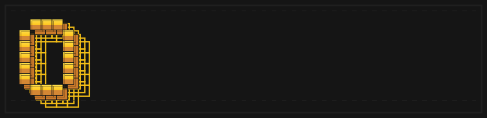

<p align="center">
  <strong>语言切换：</strong><a href="./README.md">English</a> | <a href="./README.zh-CN.md">简体中文</a>
</p>

<p align="center">
  
</p>

<p align="center">
  <a href="./skills/open-gui-bootstrap/SKILL.md"></a>
  
  <a href="./docs/get-started.md"></a>
  <a href="./LICENSE"></a>
  
</p>

> 在用 Claude 或 Codex？直接对它说：**“帮我把 OpenGUI 跑起来，只在必须时告诉我手机上要做什么。”**

## Quick Prompts

```text
帮我把 OpenGUI 跑起来，只在必须时告诉我手机上要做什么。
用 Claude 帮我 bootstrap OpenGUI。
帮我用 GPT 和 Gemini 配好 OpenGUI。
用我现有的模型 API 把 OpenGUI 跑起来。
```

OpenGUI 是一套面向真实 Android 设备的 AI Operator Stack。

你可以直接用 **Claude 或 Codex** 来启动它，让 AI 处理大部分终端侧准备工作，包括 bootstrap、依赖检查、客户端构建和 `adb` 连线。

你也可以接入自己已有的模型 API。OpenGUI 不是绑定单一模型厂商的系统，而是面向 **Claude、GPT、Gemini、Kimi、MiniMax** 等主流模型，以及其他兼容的文本或视觉接口来设计的。

它面向的是可重复运行的移动工作流，而不只是一次性的手机 Agent Demo。

它最初来自内部移动自动化场景，现在正在逐步开放出来，供更多开发者、研究者和团队使用。

## 直接用 Claude 或 Codex 启动

默认推荐的首跑路径，不应该是手工配置一大堆环境。

如果你在使用 **Claude 或 Codex**，优先从仓库内置 bootstrap skill 开始：[`skills/open-gui-bootstrap/SKILL.md`](./skills/open-gui-bootstrap/SKILL.md)

你应该可以直接用口头描述来触发它，例如：

- “帮我把 OpenGUI 跑起来”
- “用 Claude 帮我 bootstrap OpenGUI”
- “帮我用 GPT 和 Gemini 配好 OpenGUI”
- “把 OpenGUI 跑起来，只告诉我手机上必须点什么”

目标很简单：尽可能把 setup 工作交给 AI。

这个 skill 设计出来就是为了让 AI 处理：

- checkout 可运行性判断
- 依赖安装和校验
- 后端 bootstrap
- 环境文件生成
- 模型提供方选择
- Android 客户端构建
- 在可能情况下处理 `adb` 检查和端口反向代理

用户只需要处理物理世界相关步骤：

- 连接手机或启动模拟器
- 在设备上点选 USB 调试授权
- 开启 AccessibilityService
- 授予悬浮窗和电池权限
- 在需要时提供模型 API Key

如果当前 checkout 只是公开文档快照，skill 会直接说明无法启动，而不会假装项目已经能跑起来。

## 自带你的模型 API

OpenGUI 不绑定单一模型供应商。

你可以接入团队已经在使用的模型 API，用于规划、推理和视觉理解，包括：

- Claude
- GPT
- Gemini
- Kimi
- MiniMax
- 其他 OpenAI-compatible 或自定义兼容接口

这点对真实部署很重要，因为团队通常需要按这些维度自由选型：

- 成本
- 延迟
- 可用性
- 区域
- 任务效果
- 内部合规要求

## 为什么它看起来不一样

OpenGUI 的关键不只是“能看懂屏幕”，而是执行系统被补完整了。

它更像一套真实 operator stack，而不是单独的 phone-agent experiment：

- **设备侧 Android 原生执行器**
- **后端任务编排和生命周期管理**
- **飞书、Telegram、API 远程任务入口**
- **结构化结果回传给外部系统**

这几个部分放在一起，决定了它更适合可重复的工作流，而不只是本地实验。

## OpenGUI 和典型手机 Agent 框架的区别

| 维度 | 典型手机 Agent 框架 | OpenGUI |
|---|---|---|
| **控制链路** | 通常由电脑侧 ADB 调试循环驱动 | Android 原生客户端通过 AccessibilityService 执行动作 |
| **系统形态** | Agent loop 加模型调用 | 后端加 Android 客户端加任务生命周期 |
| **任务入口** | 多为本地 CLI 或脚本触发 | 支持飞书、Telegram、REST API 下发 |
| **执行方式** | 更适合本地实验和调试 | 更适合远程操作和可重复的内部工作流 |
| **输出结果** | 多为执行过程结果 | 可返回给外部系统的结构化任务结果 |

## 一眼看懂 OpenGUI

| 方向 | OpenGUI 提供什么 |
|---|---|
| **Android 原生执行** | 不是只依赖电脑侧桥接，而是运行常驻 Android 客户端 |
| **视觉优先执行** | 基于截图理解界面状态，而不是依赖写死的选择器 |
| **多步任务规划** | 把目标拆成子任务，执行、复核、重试 |
| **后端任务编排** | 在服务端管理任务状态、执行流程和结果回传 |
| **远程任务下发** | 支持通过飞书、Telegram 或 REST API 触发任务 |
| **模型自由接入** | 不强绑单一厂商，支持接入你自己的模型 API |

## 这意味着什么

如果你要的是下面这些能力，OpenGUI 会更匹配：

- 让 Android 设备持续在线并可远程操作
- 从聊天工具或后端系统触发移动任务
- 返回结构化结果，而不只是动作轨迹
- 在真实设备执行上构建内部 AI Operator
- 自己决定使用哪家的模型 API，而不是被固定供应商绑定
- 从一次性本地调试，走向可重复运行的工作流

## 典型使用场景

- 搜索微博上的 AI 新闻并汇总前几条结果
- 打开 X 并采集某个主题的近期内容
- 在 Android 设备上执行重复性的移动工作流
- 从飞书或 Telegram 远程触发手机任务
- 在不构建单 App 适配器的前提下，原型化内部 AI Operator

## Quick Install

### 开始之前

公开仓库可能会先放出文档、skill 资产和 release planning 材料，再逐步放出完整可运行代码树。如果你想让 AI 自动判断当前 checkout 到底能不能跑，先用 bootstrap skill。

### 前置依赖

需要准备：

- Node.js `>= 22`
- pnpm `>= 10`
- Docker
- Android Studio
- 建议安装 `adb`
- 你想使用的模型 API Key

### 1. 克隆仓库

```bash
git clone https://github.com/Core-Mate/open-gui.git
cd open-gui
```

### 2. 启动服务端

```bash
cd server
./start.sh
```

`start.sh` 是推荐的本地启动方式。它预期会自动完成：

- 检查 Node.js、pnpm、Docker
- 启动 PostgreSQL 和 Redis
- 如果不存在，则从 `.env.example` 创建 `apps/backend/.env`
- 安装依赖
- 生成 Prisma Client
- 初始化数据库结构
- 在 `7777` 端口启动后端服务

第一次运行时有一个重要行为：

- `start.sh` 会先创建 `apps/backend/.env`，然后主动退出
- 你需要先填写 API Key
- 然后再次执行 `./start.sh`

至少需要配置你打算用于规划和视觉理解的模型接口。

服务端启动后可访问：

- API：`http://localhost:7777/api`
- Swagger：`http://localhost:7777/docs`

### 3. 构建并安装 Android 客户端

```bash
cd ../client
./gradlew assembleDebug
adb install app/build/outputs/apk/debug/app-debug.apk
```

也可以直接用 Android Studio 打开 `client/` 并运行。

### 4. 让 Android 客户端连接本地服务端

当前运行时默认地址是：

```text
http://127.0.0.1:7777
```

本地开发最简单的方式是：

```bash
adb reverse tcp:7777 tcp:7777
```

如果你使用真机且不方便走 `adb reverse`，可以在 App 的 Settings 页面把 `BaseUrl` 改成你电脑的局域网地址，例如：

```text
http://192.168.1.10:7777
```

### 5. 打开 Android 必要权限

OpenGUI 至少需要以下权限才能稳定工作：

- 无障碍服务
- 悬浮窗权限
- 电池优化豁免或后台无限制

否则任务执行和后台稳定性都会受影响。

## 首次运行

默认公开 onboarding 路径应当比内部部署路径更轻。

对于第一次评估，优先使用下面这些入口：

- 先用 bootstrap skill，让 Claude 或 Codex 处理环境检查和终端侧启动
- 在后端和设备连通后，通过 `http://localhost:7777/docs` 的 Swagger 直接调试
- 如果已经接好飞书、Telegram 或你自己的系统，也可以直接从这些入口触发任务

手机号登录和 OTP 鉴权属于部署层配置，不应该作为公开评估时的默认首跑路径。

## CLI / Runtime Quick Reference

| 操作 | 命令 / 路径 |
|---|---|
| 启动后端 | `cd server && ./start.sh` |
| 构建 Android App | `cd client && ./gradlew assembleDebug` |
| 安装 APK | `adb install app/build/outputs/apk/debug/app-debug.apk` |
| 本地端口转发 | `adb reverse tcp:7777 tcp:7777` |
| 后端文档 | `http://localhost:7777/docs` |
| 后端 API | `http://localhost:7777/api` |
| 主配置文件 | `server/apps/backend/.env` |
| Android 服务端覆盖地址 | App Settings -> `BaseUrl` |

## 架构说明

OpenGUI 主要由两部分组成：

- `server/`：大脑
- `client/`：双手

后端负责规划任务、管理执行状态和向设备派发任务。
Android 客户端负责保持待命连接、截图，并通过无障碍服务执行动作。

<p align="center">
  
</p>

高层执行流程：

```text
任务 / API / IM 请求
  -> Planner
  -> Executor
  -> Android 动作执行循环
  -> Reviewer / 重试
  -> Summarizer
  -> 结构化结果
```

## 当前范围与限制

OpenGUI 现在已经可用，但更准确的定位是：一个仍在持续演进的开源移动 operator framework，而不是已经完全产品化的终端产品。

目前需要注意的边界包括：

- 当前活跃客户端目标是 Android
- 后端有一部分模块在公开版本中仍然是 stub
- 生产级部署、可观测性和多设备编排还在演进中
- 实际稳定性依赖于 App UI 复杂度、模型质量和设备权限状态
- 某些文档和功能面还保留着从内部系统迁移为开源版本的痕迹

如果你准备在内部场景中采用 OpenGUI，通常还需要补齐部署、护栏、评估和任务定制这部分工程工作。

## Documentation

- [skills/open-gui-bootstrap/SKILL.md](./skills/open-gui-bootstrap/SKILL.md)
- [PUBLIC_RELEASE_PLAN.md](./PUBLIC_RELEASE_PLAN.md)
- [docs/get-started.md](./docs/get-started.md)
- [CONTRIBUTING.md](./CONTRIBUTING.md)
- [SECURITY.md](./SECURITY.md)
- [CODE_OF_CONDUCT.md](./CODE_OF_CONDUCT.md)
- [CLAUDE.md](./CLAUDE.md)

## Community / Support

如果 OpenGUI 对你有帮助，最有效的支持方式包括：

- 给仓库点 Star
- 提交 bug 和 feature request
- 分享真实使用场景和部署反馈
- 贡献文档、集成和修复
- 推荐给正在做移动 AI Agent 的团队

对于一个从内部基础设施逐步走向公开框架的项目来说，真实使用反馈尤其重要，因为它会直接影响接下来哪些能力最值得优先做成 public-grade。

## License

OpenGUI 采用 Apache 2.0 License。

详见 [LICENSE](./LICENSE).
