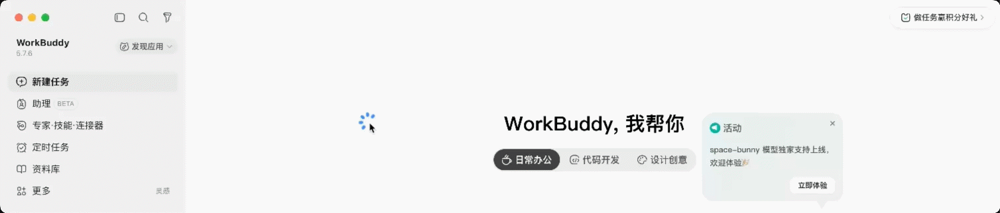
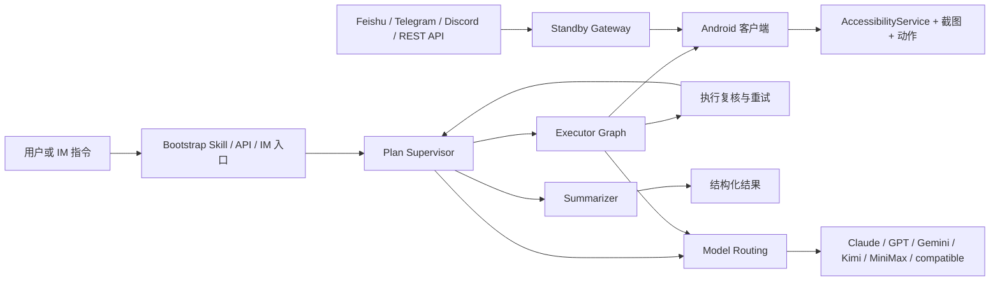

<p align="center">
  <strong>语言切换：</strong><a href="./README.md">English</a> | <a href="./README.zh-CN.md">简体中文</a> | <a href="./README.ja-JP.md">日本語</a>
</p>

<p align="center">
  
</p>

<p align="center">
  <a href="https://trendshift.io/repositories/183339"></a>
</p>

<p align="center">
  <a href="#workbuddy-安装"></a>
  <a href="#在-deepseek-harness-中使用-opengui"></a>
  <a href="./skills/open-gui-bootstrap/SKILL.md"></a>
  
  <a href="./docs/get-started.zh-CN.md"></a>
</p>

<p align="center">
  <strong>面向 Android 的移动端 GUI Agent 框架。</strong>
</p>

<p align="center">
  OpenGUI 让 AI Agent 能够看懂、理解并操作真实 Android 设备上的 App 界面。
</p>

<p align="center">
  <strong>在 WorkBuddy 或 DeepSeek Harness 中使用 OpenGUI。</strong><br>
  安装插件、连接手机，即可用自然语言下达任务，无需部署完整后端。
</p>

## 功能简述

OpenGUI 让 AI 根据真实屏幕截图理解 App，用自然语言完成手机操作和测试任务。

- **手机操作**：打开 App、点击、滑动、输入、返回和切换页面，执行多步骤流程。
- **App 测试**：检查功能和操作流程，记录异常、复现步骤与截图，汇总测试结果。
- **内容与信息处理**：读取页面信息、整理内容、填写表单，准备社媒图文草稿。
- **可视化执行**：在 WorkBuddy 工作台查看手机画面、任务步骤和报告，按需接管或停止任务。
- **宿主集成**：接入 WorkBuddy 或 DeepSeek Harness；DSH 插件还支持托管浏览器操作。

## 常用命令

安装并授权后，在对应宿主的聊天中输入以下指令。将 `【占位内容】` 替换为实际任务信息。

| 用途 | 宿主 | 输入示例 |
|---|---|---|
| 打开 OpenGUI | WorkBuddy | `/opengui` |
| 检查设备连接 | WorkBuddy | `/opengui 查看已连接的设备，暂时不要操作手机。` |
| 执行手机操作 | WorkBuddy | `/opengui 打开手机设置，再返回桌面，确认回到桌面后结束。` |
| 测试 App | WorkBuddy | `/opengui 测试【应用／页面】的【功能或流程】，记录异常、操作步骤和截图，到【结束条件】时停止。` |
| 准备小红书草稿 | WorkBuddy | `/opengui 在小红书中为【xxx主题】准备图文草稿，使用【xxx、xxx素材】，停止在点击发布按钮前。` |
| 在 DSH 中执行任务 | DeepSeek Harness | `@OpenGUI 打开设置并报告 Android 版本` |

## WorkBuddy 安装

支持 **macOS（Apple 芯片 / Intel）和 WorkBuddy 5.5.3 及以上版本**。当前公开版本为 [0.4.0 公测预发布版](https://github.com/Core-Mate/OpenGUI/releases/tag/opengui-workbuddy-v0.4.0)。在电脑上下载并运行安装脚本，安装后重启一次 WorkBuddy，再完成授权。

> [!IMPORTANT]
> **安装后需要重启一次 WorkBuddy。** 请先结束其他任务，用 **⌘Q 完全退出** WorkBuddy，再重新打开，然后授权 OpenGUI。只关闭窗口不算退出。

**步骤1.Terminal命令下载安装**

打开 macOS“终端”，粘贴并运行：

```sh
cd "$HOME" && curl -fsSL https://raw.githubusercontent.com/Core-Mate/OpenGUI/main/workbuddy-plugin/install.sh | bash
```

这条命令会下载并运行安装脚本，无需先手动保存文件。脚本会校验后续安装文件、准备运行环境并配置 OpenGUI。

Node 和 npm 依赖默认使用国内 npmmirror，下载失败时回退官方源，只影响本次安装。需要官方源时，将命令末尾的 `bash` 改为 `bash -s -- --download-source official`。视频组件来自 GitHub，换 npm 源不会加速它；有自己的视频镜像时，可加 `--video-mirror https://镜像地址/归档目录`，详见[下载源选项](workbuddy-plugin/INSTALL.md#download-sources)。

也可以[单独下载安装脚本（install.sh）](https://raw.githubusercontent.com/Core-Mate/OpenGUI/main/workbuddy-plugin/install.sh)，保存后在终端运行 `bash /实际路径/install.sh`。

**步骤2.重启一次 WorkBuddy**

安装脚本完成后，先结束 WorkBuddy 中的其他任务，按 **⌘Q** 完全退出，再重新打开 WorkBuddy，使新安装的 MCP 配置加载生效。

**步骤3.授权技能和连接器**

打开 WorkBuddy 的“专家·技能·连接器 → 技能”，找到 OpenGUI，按提示完成授权；之后在连接器中，找到OpenGUI，再次授权。

**注意：技能 和 连接器，都需要授权哦！**



若找不到连接器中的 OpenGUI，可打开“自定义连接器”检查 MCP 服务。授权页面未自动打开时，可打开终端打印的 `AUTHORIZATION_GUIDE` 路径，无需重新安装。

**步骤4.验证连接并开始使用**

把Android手机打开USB调试，连上电脑，输入/opengui，输入需要给手机的执行指令，即可控制手机执行。首次连接时，请在手机上允许 USB 调试授权。

试一试：用小红书发帖

```text
/opengui 在小红书中为【xxx主题】准备图文草稿，使用【xxx、xxx素材】，停止在点击发布按钮前。
```

试一试：Vibe Testing

```text
/opengui 帮我测试【应用／页面】的【功能或操作流程】，重点检查【关注的问题】。如果发现异常，记录操作步骤和截图，当做到【结束条件】就停。
```

## 在 DeepSeek Harness 中使用 OpenGUI

第一次使用 DSH 插件时，可先阅读 [OpenGUI × DeepSeek Harness 简明说明与 FAQ](./deepseek-harness-plugin/docs/quick-start-and-faq.zh.md)。

macOS 上最短的路径，是让 Codex 运行 `main` 分支上的稳定安装 Skill。每次执行时，安装器都会解析并安装最新正式版 OpenGUI 插件，同时保留指定版本参数用于回滚。环境需要 Node.js 22.19+ 或 24+，兼容的 DSH 版本会自动安装。把下面整段作为一条消息发给 Codex：

```text
请安装并运行这个 OpenGUI 安装 Skill：https://github.com/Core-Mate/OpenGUI/tree/main/deepseek-harness-plugin/skills/opengui-coremate-install，把最新正式版插件安装到我的 DSH web profile。请自主完成安装，仅在需要我授权或选择手机、添加或选择 DSH workspace，或者提供备用视觉模型凭据时暂停并询问我。
```

Skill 会下载公开 Release 的插件包和校验文件，验证 SHA-256，只安装 OpenGUI 插件，在需要时启动并打开 DSH，同时保留其他 DSH 插件和设置。安装器会说明它是否已重启受管理的 DSH，或者是否需要先退出已有进程再重新运行。Linux 或 Windows 用户可按[手动安装说明](./deepseek-harness-plugin/README.zh.md#1-下载发布包)操作。

DSH 版本以[安装器兼容清单](./deepseek-harness-plugin/skills/opengui-coremate-install/dsh-compatibility.json)为准，默认使用 `0.1.1-rc.2`；可用 `--dsh-version VERSION` 指定清单内的版本。安装器保留其他插件、工作区、模型设置和凭据。版本切换与回滚注意事项见[插件安装说明](./deepseek-harness-plugin/README.zh.md#支持范围与前置条件)。

安装完成后，在 DSH 中添加或选择工作区，连接并选择已授权的 Android 手机，然后发送：

```text
@OpenGUI 打开设置并报告 Android 版本
```

插件可以直接为 DSH 增加手机与浏览器操作能力，不需要部署完整的 OpenGUI 后端。当前源码按 DSH Session 接纳根任务，允许不同 Tab 使用不冲突的手机集合；托管浏览器仍保持全局串行。这是源码行为说明，不代表已发布。你还可以查看更多[使用场景](./deepseek-harness-plugin/docs/use-cases.zh.md)，或下载 [v0.1.13 安装包](https://github.com/Core-Mate/OpenGUI/releases/tag/dsh-coremate-mobile-v0.1.13)。

执行 GUI 任务的模型需要支持图片输入和工具调用。DSH 默认复用当前会话模型；不兼容时再配置备用视觉模型，详见[模型配置说明](./deepseek-harness-plugin/docs/quick-start-and-faq.zh.md#如何配置模型)。请按自己的任务验证执行效果、耗时和实际费用。

## 运行完整 OpenGUI 技术栈

需要自托管后端、Android 客户端，或通过飞书、Telegram、Discord、REST API 派发任务时，使用完整技术栈。WorkBuddy 和 DSH 插件无需完成本节部署。

在仓库根目录打开 Claude Code、Codex 或 OpenCode，发送：

```text
Read ./skills/open-gui-bootstrap/SKILL.md and help me run OpenGUI. Only ask me for phone-side actions.
```

完整技术栈的 Android 客户端需要 Android 11（API 30）及以上、USB 调试、无障碍服务、悬浮窗权限和电池优化豁免。后端模型配置、手动启动和手机授权步骤见[完整部署指南](./docs/get-started.zh-CN.md)与[Android 权限说明](./docs/android-permissions.zh-CN.md)。

部署后，在 `server` 目录使用 CLI：

```bash
pnpm opengui -- devices --json
pnpm opengui -- do "观察当前手机屏幕，简要描述你看到了什么，然后结束" --json
pnpm opengui -- status <executionId> --json
pnpm opengui -- cancel <executionId> --json
```

`do` 异步返回 `executionId`；将其填入 `status` 查询状态，或填入 `cancel` 停止任务。远程控制接入见[CLI 与 API 指南](./docs/codex-remote-control.zh-CN.md)，Discord 配置见[对应说明](./docs/DISCORD.zh-CN.md)。

## 近期更新

- `[2026.10.8]` 发布 [WorkBuddy 插件 0.4.0 公测预发布版](https://github.com/Core-Mate/OpenGUI/releases/tag/opengui-workbuddy-v0.4.0)，提供终端安装脚本及安装后自动打开的授权指南。
- `[2026.9.1]` 发布 [DSH 插件 0.1.13](https://github.com/Core-Mate/OpenGUI/releases/tag/dsh-coremate-mobile-v0.1.13)。
- `[2026.5.16]` 新增 [Codex / Claude Code 远程控制](./docs/codex-remote-control.zh-CN.md)，提供本地 REST API、`pnpm opengui -- ...` CLI，以及 [`open-gui-remote-control`](./skills/open-gui-remote-control/SKILL.md) Skill，可从编码 Agent 下发 Android App 任务。
- `[2026.5.9]` 新增 [Discord IM 入口](./docs/DISCORD.zh-CN.md)，支持前缀命令、Slash 命令、安全白名单和 guild-scoped 命令注册，可从 Discord 频道远程下发 Android 任务。
- `[2026.5.7]` 本地启动流程增强，Docker 方式启动后端时会避开常见的 PostgreSQL 和 Redis 端口冲突。
- `[2026.5.1]` 后端上手流程补齐 `.env.example`、启动检查提示和 graph agent 的 VLM 环境变量配置。

## 使用要求与限制

| 使用方式 | 电脑与运行环境 | Android 设备准备 |
|---|---|---|
| WorkBuddy 插件 | macOS（Apple 芯片 / Intel），WorkBuddy 5.5.3 及以上；安装脚本准备私有运行环境。 | 开启并允许 USB 调试；使用电脑侧 ADB / scrcpy，无需部署完整后端或安装本仓库的 Android 客户端。 |
| DSH 插件 | macOS、Linux x64 或 Windows x64；Node.js 与 DSH 版本要求见[插件说明](./deepseek-harness-plugin/README.zh.md#支持范围与前置条件)。 | 开启并允许 USB 调试，在 DSH 中选择设备；无需部署完整后端或安装本仓库的 Android 客户端。 |
| 完整技术栈 | 本地后端及构建环境，见[部署指南](./docs/get-started.zh-CN.md)。 | Android 11 及以上，并授予客户端所需的无障碍、悬浮窗和电池权限。 |

- 部分手机需要额外开启厂商提供的 USB 输入控制权限；按连接诊断提示在手机上处理。
- WorkBuddy 跟随当前对话模型；DSH 会话模型、完整后端的模型配置是不同入口，请按对应安装方式配置。
- 执行效果与模型、App 界面、网络和任务长度有关。长时任务与不同设备的可靠性仍需要更多真实场景验证。
- WorkBuddy 的短信登录默认使用官方 CoreMate 账号服务，不读取线上模型配置；任务截图会发送给当前 WorkBuddy 模型，本地预览视频不会逐帧上传。具体数据流见[WorkBuddy 插件说明](./workbuddy-plugin/README.zh-CN.md)与[DSH 插件说明](./deepseek-harness-plugin/README.zh.md)。

## Roadmap

- 补充更多真实 App 使用案例与测试报告。
- 优化一键本地启动流程。
- 增加更多可直接运行的 phone-use 任务模板。
- 提升执行恢复和失败反馈能力。
- 增加 Android GUI Agent 可靠性 benchmark 任务。
- 完善模型配置和省钱混用方案文档。
- 推出托管版 OpenGUI Agent 服务，让不想自行部署完整技术栈的团队也能使用 GUI 操作能力。

## 系统结构

下图仅描述完整后端与 Android 客户端的执行链路。WorkBuddy 与 DSH 使用各自的插件运行时。


```mermaid
flowchart LR
    U["用户或 IM 指令"] --> BS["Bootstrap Skill / API / IM 入口"]
    BS --> SP["Plan Supervisor"]

    SP --> EX["Executor Graph"]
    EX --> AC["Android 客户端"]
    AC --> GX["AccessibilityService + 截图 + 动作"]
    EX --> RV["执行复核与重试"]
    RV --> SP

    SP --> SM["Summarizer"]
    SM --> SR["结构化结果"]

    RD["Feishu / Telegram / Discord / REST API"] --> ST["Standby Gateway"]
    ST --> AC

    SP --> MR["Model Routing"]
    MR --> MA["Claude / GPT / Gemini / Kimi / MiniMax / compatible"]
    EX --> MR
```

### 运行时核心部件

- **后端 graph**：`server/apps/backend/src/modules/graph-agent/graph/`
- **任务 API**：`server/apps/backend/src/modules/task/task.controller.ts`
- **待命派发**：`server/apps/backend/src/common/ws/standby.gateway.ts`
- **IM 入口派发**：`server/apps/backend/src/modules/im-channel/`
- **设备待命连接**：`client/core_network/src/main/java/com/coremate/opengui/network/websocket/StandbySocketManager.kt`
- **Android 执行链路**：`client/core_accessibility/src/main/java/com/coremate/opengui/accessibility/GestureService.kt`

## 文档

- [WorkBuddy 安装验证与排障](./workbuddy-plugin/INSTALL.md)
- [WorkBuddy 插件说明](./workbuddy-plugin/README.zh-CN.md)
- [DeepSeek Harness 插件说明](./deepseek-harness-plugin/README.zh.md)
- [skills/open-gui-bootstrap/SKILL.md](./skills/open-gui-bootstrap/SKILL.md)
- [docs/get-started.zh-CN.md](./docs/get-started.zh-CN.md)
- [server/apps/backend/README.md](./server/apps/backend/README.md)
- [docs/DISCORD.zh-CN.md](./docs/DISCORD.zh-CN.md)
- [client/README.md](./client/README.md)
- [CONTRIBUTING.md](./CONTRIBUTING.md)
- [SECURITY.md](./SECURITY.md)
- [CLAUDE.md](./CLAUDE.md)

## 社区 / 支持

欢迎加入 [OpenGUI Discord 社区](https://discord.gg/pqHHw7XgJ3)，讨论 GUI Agent 技术方向、分享真实使用场景并获取版本动态。经过验证的微信群入口准备好后，也会在这里公开。

托管版 OpenGUI Agent 服务开放后，社区成员还可以申请 Agent 体验额度。具体名额、领取条件和有效期将随服务一同公布。

最有价值的项目反馈包括：

- 提交 bug 和 feature request
- 分享真实使用场景和部署反馈
- 贡献文档、集成和修复

## 许可证

OpenGUI 采用 Business Source License 1.1 (BUSL-1.1)，源码可见。

你可以复制、修改、分发源码，并用于非生产用途。生产使用、商业使用、托管服务、集成到商业产品中，都需要 Core-Mate 的单独商业授权。

当前版本：

- Change Date: 2030-04-29
- Change License: Apache License, Version 2.0

这代表源码公开 / source-available，但在 Change Date 前不是 OSI 批准的许可证。

详见 [LICENSE](./LICENSE)。
