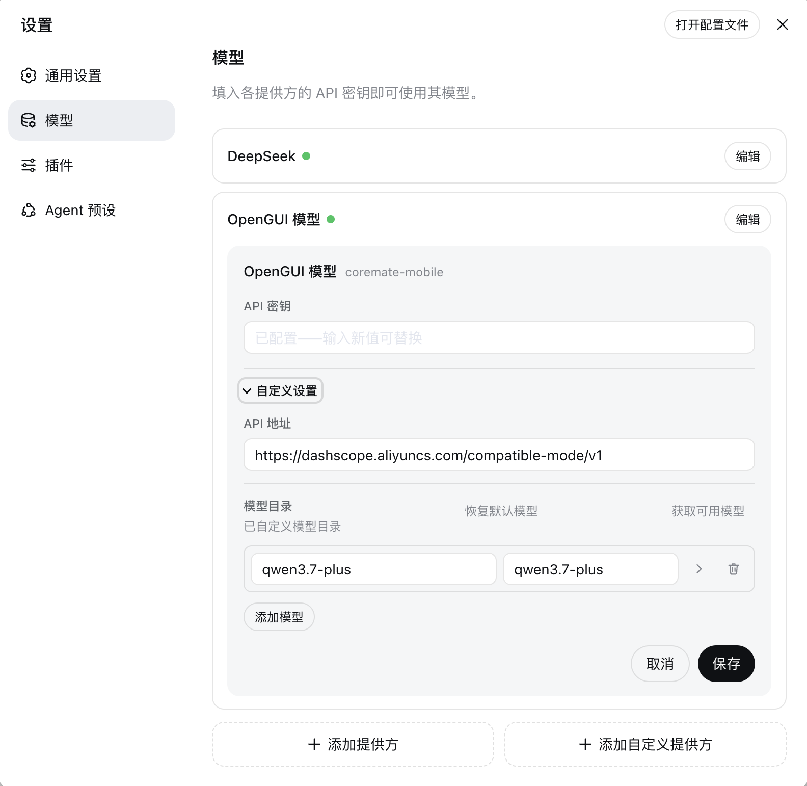
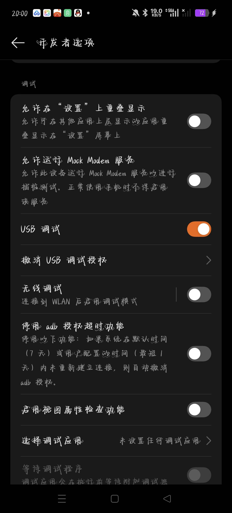

# OpenGUI × DeepSeek Harness 简明说明与 FAQ

这份文档面向第一次接触 DeepSeek Harness（以下简称 DSH）和 OpenGUI 的用户。目标是在不部署完整 OpenGUI 后端的情况下，用 DSH 控制已授权的 Android 手机，并在需要时操作插件托管的本地浏览器。

## 一句话说明

DSH 是运行 AI Agent 的工作台；OpenGUI 以插件形式为 DSH 增加手机和浏览器操作能力。安装完成后，用户可以在 DSH 对话中用自然语言下达任务，例如：

```text
@OpenGUI 打开设置并报告 Android 版本
```

OpenGUI 会优先复用当前 DSH 会话模型。该模型需要同时支持图片输入和工具调用；只有当前模型不兼容时，才需要额外配置视觉模型。

## DSH 和 OpenGUI 如何配合

| 组成部分 | 负责什么 |
|---|---|
| DSH | 管理 workspace、对话、模型和 Agent 运行环境。 |
| OpenGUI 插件 | 把手机与托管浏览器能力接入 DSH，并提供 `@OpenGUI`、`/opengui` 和 OpenGUI Tab。 |
| Android 手机 | 展示真实 App 界面并执行点击、滑动、输入、返回、主页等受限操作。 |
| 视觉模型 | 阅读截图、判断下一步，并通过工具发起操作。 |

用户只需要在 DSH 中描述目标。OpenGUI 会判断任务需要手机、浏览器，还是先后使用两者。模型不会获得任意 ADB 或系统命令权限。

### 几个容易混淆的词

| 名称 | 在这里指什么 |
|---|---|
| DSH 工作区（Workspace） | 你在 DSH 中打开的项目目录和任务上下文。开始对话前需要先添加或选择一个工作区。 |
| Web Profile | DSH 的一套插件与配置环境。OpenGUI 安装在 `web` Profile 中，不等于某个项目目录。 |
| 模型供应商（Provider） | 提供模型 API 的服务，例如豆包、通义千问或 OpenAI。 |
| 模型（Model） | 供应商下实际执行任务的视觉语言模型，需要同时支持图片输入和工具调用。 |

## 能做什么

- 在已授权的 Android 手机上执行界面操作和回归测试。
- 读取页面信息、填写表单、切换 App、完成重复性流程。
- 在获得人工确认后执行发布、发送、购买、删除等敏感操作。
- 选择多台手机并行执行同一批任务，默认最多 4 台。
- 在任务需要网页操作时，使用插件托管的本地 Chromium。

OpenGUI 只应操作设备所有者明确授权的手机、账号和业务流程，并遵守目标 App、网站及账号的使用规则。

常见场景包括：

- QA：走查页面、复现问题、执行回归流程并汇总差异。
- 运营：查看内容和评论、整理待处理对象；发布、私信或修改账号前必须确认。
- 手游测试：签到、领取免费资源、检查固定流程；付费、抽卡或消耗稀缺资源前必须确认。
- 多设备验证：在多台已选手机上执行同一流程并对比结果。
- 手机与网页协同：先从手机读取信息，再到网页查询或整理结果。

不适合的场景包括未获授权的设备或账号操作、绕过平台规则、静默后台控制、任意文件传输和任意系统命令执行。

## 使用前准备

- macOS、Linux x64 或 Windows x64 电脑。
- Node.js `22.19+`（Node 22）或 `24+`。
- DeepSeek Harness `0.1.0-rc.7`、`0.1.0-rc.8`、`0.1.1-rc.1` 或 `0.1.1-rc.2`（推荐 `0.1.1-rc.2`）。
- 一台已开启 USB 调试的 Android 手机。
- DSH 中已添加或选中一个 workspace。
- DSH 当前会话已选择支持图片输入和工具调用的模型。

Linux arm64 和 Windows arm64 暂未随插件提供 ADB。macOS 用户推荐让 Codex 自动安装；Linux 和 Windows 用户请使用[手动安装说明](../README.zh.md#1-下载发布包)。

## 模型怎么选

模型必须支持图片输入和工具调用。仓库当前给出的 GUI 操作推荐顺序如下：

| 优先级 | 模型系列 | 建议 |
|---|---|---|
| 1 | 豆包 VLM | 当前推荐优先用于可视化 GUI 操作。 |
| 2 | 千问 VLM | 可作为替代方案；部分社媒任务可能更容易触发模型安全策略。 |
| 3 | OpenAI 视觉模型 | 能力可用，但截图密集型任务的成本通常更高。 |
| 4 | Grok 视觉模型 | 目前属于实验选项，工具调用和操作稳定性仍需继续验证。 |

模型可用性、价格和策略会随版本及地区变化。OpenGUI 默认使用当前 DSH 会话模型，不要求用户一开始就单独配置视觉模型。

### 如何配置模型

推荐先使用当前 DSH 会话模型。只要该模型同时支持图片输入和工具调用，OpenGUI 就能直接复用，不需要再填一套 API 信息。

如果当前模型不兼容，或者希望 OpenGUI 固定使用另一套视觉模型，可按下面步骤配置：

1. 打开 DSH 的“设置”，进入“模型”，找到 **OpenGUI 模型**并点击“编辑”。



*OpenGUI 模型编辑示例：API 密钥保存后不会回显；模型 ID 和 API 地址请以实际服务商文档为准。*

2. 根据模型服务商提供的 API 文档填写页面中显示的参数：

| 字段 | 怎么填 |
|---|---|
| API 地址 | 填模型 API 的基础地址，例如服务商给出的 OpenAI 兼容地址；不要填控制台或产品主页网址。 |
| 模型 ID | 填服务商给出的准确模型标识，不要填展示名称。该模型必须支持图片输入和工具调用。 |
| API Key | 填模型服务商创建的密钥。保存后不会回显；以后不修改密钥时保持输入框为空。 |
| 上下文容量 | 填该模型实际支持的上下文 Token 上限；不确定时查询服务商文档，不要填得高于模型上限。 |
| 最大输出 Token | 填该模型单次响应允许的最大输出 Token；不能超过服务商限制。 |

3. 点击模型卡片中的“保存”，等待 OpenGUI 模型旁的状态点变为绿色。

4. OpenGUI 默认优先复用当前 DSH 会话模型，专用模型默认使用 Responses API。模型页面不显示这两个高级选项；如需始终使用专用模型，或服务商只支持 Chat Completions，请在模型卡片保存成功后点击右上角“打开配置文件”，在 `coremate-mobile` 下加入对应配置：

```yaml
coremate-mobile:
  modelStrategy: dedicated
  api: openai-completions
```

只需修改实际需要的字段；使用默认策略或 Responses API 时不要额外添加。

5. 完成页面和配置文件中的修改后，提交一条不会修改数据的测试任务：

```text
@OpenGUI 打开设置并报告 Android 版本
```

如果“模型”页面中没有 **OpenGUI 模型**，先更新 OpenGUI 插件并完全重启 DSH。出现 `401`、`unauthorized` 或 API Key 错误时，优先核对 Base URL、接口协议、模型 ID 和 API Key 是否属于同一个模型服务。不要把真实 API Key 发到聊天、Issue、截图或 Git 仓库中。

## macOS 最快安装方式

把下面整段作为一条消息发送给 Codex：

```text
请安装并运行这个 OpenGUI 安装 Skill：https://github.com/Core-Mate/OpenGUI/tree/main/deepseek-harness-plugin/skills/opengui-coremate-install，把最新正式版插件安装到我的 DSH web profile。请自主完成安装，仅在需要我授权或选择手机、添加或选择 DSH workspace，或者提供备用视觉模型凭据时暂停并询问我。
```

安装器会自动完成以下工作：

1. 检查 Node.js 和 macOS 环境。
2. 安装兼容的 DSH 版本。
3. 下载最新稳定版 OpenGUI 插件及 SHA-256 校验文件。
4. 校验安装包，只更新 DSH `web` profile 中的 OpenGUI 插件。
5. 保留其他 DSH 插件和设置，并启动 DSH。

默认访问地址为：

```text
http://127.0.0.1:3080
```

## 手机如何开启 USB 调试

不同品牌的菜单名称略有区别，但流程基本相同：先开启开发者选项，再开启 USB 调试，最后允许这台电脑连接。

### 普通 Android 手机

1. 打开手机“设置”，进入“关于手机”或“关于本机”。
2. 连续点击“版本号”“软件版本号”或“系统版本”约 7 次，直到手机提示已进入开发者模式。部分手机会要求输入锁屏密码。
3. 返回设置，进入“系统”“更多设置”或“其他设置”，找到“开发者选项”。
4. 打开“开发者选项”和“USB 调试”。
5. 用支持数据传输的 USB 线连接电脑，保持手机解锁。若手机询问 USB 用途，可选择“文件传输”或“MTP”。
6. 手机弹出“是否允许 USB 调试”时，核对电脑的 RSA 指纹，选择“允许”。常用电脑可以同时勾选“始终允许使用这台计算机进行调试”。



*普通 Android 手机示例：在“开发者选项”中打开“USB 调试”。*

仅打开 USB 文件传输不能替代 USB 调试。如果连接后没有授权弹窗，可在开发者选项中点击“撤销 USB 调试授权”，重新插拔数据线后再次允许。

### 小米、Redmi、POCO 等部分手机

在 MIUI 或 HyperOS 的“开发者选项”中，除了 **USB 调试**，还需要检查并开启 **USB 调试（安全设置）**。这个额外开关允许电脑通过调试连接执行点击、输入等界面操作；只开启普通 USB 调试时，设备可能能够被识别，但 OpenGUI 无法正常控制页面。

部分系统版本在开启“USB 调试（安全设置）”时会要求登录小米账号、插入 SIM 卡、联网或再次输入锁屏密码，具体以手机提示为准。公司管理设备或开启了工作资料的手机也可能禁止该开关，此时需要联系设备管理员，不要尝试绕过限制。

调试完成后，如不再需要连接 OpenGUI，可关闭 USB 调试和额外的安全调试开关，并拔掉数据线。

## 第一次使用

1. 在 DSH 中添加或选择一个 workspace。
2. 按上面的步骤开启 USB 调试，用数据线连接 Android 手机，保持屏幕解锁，并在手机上允许这台电脑调试。
3. 打开 DSH 的 **OpenGUI** Tab；只有一台已授权手机时会自动选中，多台手机时手动勾选目标设备。
4. 在对话中发送：

```text
@OpenGUI 打开设置并报告 Android 版本
```

也可以使用命令形式：

```text
/opengui 打开设置并报告 Android 版本
```

单独发送 `/opengui` 只会返回用法：

```text
Usage: /opengui <task>
```

运行期间可点击输入框右侧的停止按钮取消任务。任务停止后，手动打开的手机投屏窗口不会被关闭。

## DSH 页面里会看到什么

- **Workspace**：任务使用的工作目录。没有选中 workspace 时，对话输入框不可用。
- **对话区**：发送普通消息、`@OpenGUI` 或 `/opengui <任务>`。
- **OpenGUI Tab**：查看手机、选择操作目标、打开投屏，并处理浏览器安装或插件更新提示。
- **设备选择**：只有一台已授权手机时自动选中；有多台时可选择一至多台。
- **眼睛图标**：在运行 DSH 的电脑上打开该手机的独立只读投屏窗口。
- **停止按钮**：任务运行时出现在输入框右侧，用于取消当前 OpenGUI 任务。

手机刚连接时，OpenGUI 会先显示完整截图，再在后台准备低延迟实时画面。如果当前浏览器不支持实时视频，或视频流启动失败，界面仍会保留手机截图并允许重试。

## 一次任务会经历什么

1. OpenGUI 检查当前模型是否支持图片和工具调用。
2. 插件等待至少一台已授权且被选中的手机。
3. 设备选择被锁定，本次任务不会在执行中切换到其他手机。
4. 路由 Agent 判断使用手机、托管浏览器，或顺序使用两者。
5. 执行卡片持续显示可见的工具操作和结果。
6. 任务完成后返回文字结果；失败或取消时不会自动重跑。

不自动重跑是为了避免重复发送消息、发布内容、购买或删除数据。需要重试时，先确认手机和网页当前状态，再重新提交任务。

## 任务怎么写更稳定

一条好任务最好写清四件事：目标 App 或网站、要完成的结果、不能做的动作、希望返回的格式。任务越具体，模型越不容易在界面里绕路。

## 常用任务示例

```text
@OpenGUI 打开设置，读取设备名称和 Android 版本
```

```text
@OpenGUI 打开目标 App，检查登录页的主要控件是否正常显示，不要提交任何信息
```

```text
@OpenGUI 在已选手机上分别执行同一条回归流程，并汇总差异
```

```text
@OpenGUI 打开 https://example.com，读取页面标题并返回
```

```text
@OpenGUI 打开目标 App 的登录页，检查手机号输入框、验证码按钮和用户协议入口是否可见；不要输入或提交任何账号信息；按“通过/异常/证据”三列汇总
```

```text
@OpenGUI 查看当前页面前 5 条评论，只做摘要和分类，不点赞、不回复、不关注
```

涉及发布、发送消息、购买、删除或账号修改时，OpenGUI 会在产生实际影响前再次请求人工确认。

## 快速排查

| 现象 | 先检查什么 |
|---|---|
| DSH 页面打不开 | 打开 `http://127.0.0.1:3080`，并确认 3080 端口没有被其他程序占用。 |
| 输入框不可用 | 添加或选择一个 workspace。 |
| `/opengui` 无法识别 | 完全重启 DSH，确认插件已加入 `web` profile。 |
| OpenGUI Tab 没有手机 | 解锁手机、检查 USB 调试授权并重新连接数据线；小米等机型还要检查“USB 调试（安全设置）”。 |
| 模型能聊天但不操作 | 确认模型支持图片输入和工具调用；需要时在“设置 → 模型 → OpenGUI 模型”中配置专用模型。 |
| 任务停在同一画面 | 检查锁屏、授权弹窗和网络；停止后用更短的任务重试。 |
| 出现 401 或 API Key 错误 | 检查模型服务凭据、Base URL 和 API 协议。 |

## 常见 FAQ

### 1. 是否需要部署完整的 OpenGUI 后端和 Android APK？

不需要。DSH 插件自带受限的手机控制能力，可直接连接已授权 Android 手机。只有需要体验完整 OpenGUI 服务端、任务系统或 Android 客户端时，才需要部署完整技术栈。

### 2. 是否需要 Root 手机或解锁 Bootloader？

不需要。插件通过随包 ADB 与手机通信，只要求开启 USB 调试并在手机上确认授权。小米、Redmi、POCO 等部分机型还需要开启“USB 调试（安全设置）”，但不需要 Root 或解锁 Bootloader。

### 3. 为什么 DSH 页面里不能输入任务？

先添加或选择一个 DSH workspace。没有 workspace 时，对话输入区域不可用。

### 4. `/opengui` 没有被识别怎么办？

完全退出并重新启动 DSH，让它重新加载插件。仍无法识别时，检查：

```sh
dsh --profile web --dump-config
```

如果终端提示找不到 `dsh`，使用等价命令：

```sh
npx @deepseek-ai/dsh@0.1.1-rc.2 --profile web --dump-config
```

输出中应包含 `dsh-coremate-mobile` 和 `id: coremate-mobile`。

### 5. OpenGUI Tab 没有显示手机怎么办？

依次检查：

1. 手机已解锁并通过数据线连接电脑。
2. 已开启开发者选项和 USB 调试。
3. 小米、Redmi、POCO 等机型已同时开启“USB 调试（安全设置）”。
4. 手机弹窗中已选择“允许 USB 调试”；如果显示 RSA 指纹，请确认后再允许。
5. 数据线支持数据传输，必要时把 USB 用途切换为“文件传输”或“MTP”。
6. 重新插拔数据线后刷新 OpenGUI Tab。

如果显示 `device unauthorized`，通常是手机端尚未允许这台电脑调试，而不是模型或 API Key 问题。保持手机解锁，重新确认授权弹窗；仍无弹窗时，撤销 USB 调试授权后重新连接。

### 6. 模型能聊天，但不会操作手机怎么办？

确认当前 DSH 模型同时支持图片输入和工具调用。仅支持文本的模型无法理解手机截图。若当前模型不兼容，请在“设置 → 模型 → OpenGUI 模型”中填写专用视觉模型，或按 OpenGUI 的交互提示完成配置，然后重新提交任务。

### 7. 出现 API Key、401 或模型 unauthorized 怎么办？

这是模型服务认证问题，与手机 USB 授权无关。检查 API Key 是否有效、Base URL 是否正确，以及所选 API 协议是否符合模型服务商要求。不要把 API Key 发到聊天、Issue 或日志中。

### 8. 安装时出现 `ERR_PNPM_IGNORED_BUILDS` 怎么办？

这是 pnpm 的安装脚本安全策略，不代表插件包损坏。请按照[详细安装说明](../README.zh.md#2-安装到-harness-profile)合并 `allowBuilds` 配置后，重新执行安装命令；不要覆盖整个 `pnpm-workspace.yaml`。

### 9. 端口 `3080` 已被占用怎么办？

先确认 `http://127.0.0.1:3080` 是否已经是 DSH。如果是，直接使用现有页面；如果不是，不要强制结束未知进程，改用其他端口启动 DSH，或先确认占用端口的程序。

### 10. 第一次网页任务为什么要求下载 Chromium？

只有任务实际需要浏览器时，插件才会请求安装固定版本的托管 Chromium。确认后会下载并校验 SHA-256，后续任务复用本地缓存，不依赖系统 Chrome。

### 11. 能否同时使用多台手机？

可以。先在 OpenGUI Tab 勾选目标手机，再提交任务。任务开始后会冻结本次设备选择，执行过程中不能更换目标设备。默认最多并行处理 4 台手机。

### 12. 任务长时间没有进展怎么办？

检查手机是否停留在授权弹窗、锁屏或异常页面，并确认模型能够稳定调用工具。可以先停止任务，再用更短、更明确的目标重试。失败任务不会自动重跑，以免重复产生手机或网页副作用。

### 13. 如何更新或回滚插件？

macOS 上可再次运行 Codex 安装 Skill，它会解析最新稳定版并保留一个可回滚版本。需要固定版本时，再显式指定版本号。OpenGUI Tab 检测到更高稳定版时也会显示更新入口；任务运行期间不会执行更新。

### 14. 如何卸载？

通过 macOS Skill 安装时，在 Skill 目录运行：

```sh
./scripts/uninstall-macos.sh
```

脚本只移除 OpenGUI 插件和对应 LaunchAgent，保留其他 DSH 插件、设置、凭据与缓存。其他系统或手动安装用户请参考[详细卸载说明](../README.zh.md#卸载)。

### 15. 只操作网页，也必须连接手机吗？

目前是。每个非空 `/opengui` 或 `@OpenGUI` 任务都会先检查至少一台已授权且被选中的手机，之后路由 Agent 才决定是否只调用浏览器。

### 16. 可以同时提交多个 OpenGUI 任务吗？

不可以。同一个插件实例同一时间只运行一个 OpenGUI 主任务，`/opengui`、`@OpenGUI` 和旧 `/coremate` 别名共用这一限制。当前任务完成或停止后再提交下一条。

### 17. OpenGUI 会把 API Key 发给手机吗？

不会。模型凭据由 DSH 管理，插件通过 DSH 的模型路由发起请求。不要把 Key 写进任务文本、截图、Issue 或 Git 仓库。

### 18. 手机投屏窗口会出现在哪里？

独立投屏窗口只会出现在运行 DSH 的电脑上。如果从另一台电脑访问 DSH Web 页面，点击眼睛图标也不会把原生窗口打开在远程电脑上。

### 19. OpenGUI 会保存哪些本地内容？

DSH profile 保存插件依赖和设置。按需下载的 scrcpy 与 Chromium 会保存在当前用户的本地缓存中，后续任务可直接复用。卸载插件不会自动删除这些缓存。

### 20. 为什么最终回复里没有截图？

直接 `/opengui` 任务的最终结果以文字为主。截图和详细工具记录保留在对应的控制子会话或执行卡片中，便于回看操作过程。

### 21. 插件更新后为什么需要重启 DSH？

DSH 在启动时加载 profile 和插件 bundle。更新成功后需要重启，新的插件代码才会生效；更新失败时会保留当前版本。

### 22. 如何确认安装成功，而不操作手机？

先单独发送：

```text
/opengui
```

如果返回 `Usage: /opengui <task>`，说明插件和命令已经加载。这个检查不会调用模型，也不会操作手机。

## 安全与隐私说明

- 插件只连接本机已授权的 Android 设备，忽略离线和未授权设备。
- 手机修改操作必须基于最新截图；重复无进展或超出操作上限会被拒绝。
- 不支持任意 shell、任意 ADB 命令、文件传输、应用安装/卸载、权限修改或设备重启。
- 浏览器控制仅允许 HTTP/HTTPS 页面和受限交互，不开放任意脚本执行或文件系统访问。
- 模型凭据由 DSH 管理；OpenGUI 不要求把 API Key 写进任务或提交到 Git。

## 求助时请提供

- 操作系统与 CPU 架构。
- Node.js、DSH 和 OpenGUI 插件版本。
- 手机型号与设备状态（不要提供账号隐私信息）。
- 出问题前执行的步骤和完整错误文本。

请勿提供 API Key、凭据文件、Cookie、账号密码或包含隐私内容的手机截图。

更多资料：

- [普通用户安装指南](install-for-beginners.zh.md)
- [完整插件说明](../README.zh.md)
- [常用场景](use-cases.zh.md)
- [OpenGUI GitHub 仓库](https://github.com/Core-Mate/OpenGUI)
- [社区支持](https://discord.gg/pqHHw7XgJ3)
