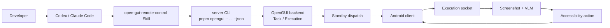

<p align="center">
  <strong>言語:</strong> <a href="./codex-remote-control.md">English</a> | <a href="./codex-remote-control.zh-CN.md">简体中文</a> | <a href="./codex-remote-control.ja-JP.md">日本語</a>
</p>

# Codex で Android スマートフォンを操作する

OpenGUI を使うと、Codex または Claude Code から自然言語のタスクを実機の Android スマートフォンへ渡せます。コーディングエージェントが座標を直接クリックしたり、Android の socket プロトコルを直接処理したりするわけではありません。OpenGUI バックエンドを通じてタスクを作成し、バックエンドがオンラインの Android クライアントへ execution をディスパッチします。

## 全体のフロー

Codex または Claude Code がコマンドの入口になります。OpenGUI バックエンドは task と execution の状態を保存し、Android クライアントはスクリーンショットの取得、アクションの実行、端末状態の返送を担当します。タスクはバックエンドに入った後、standby 接続を通じてオンライン端末へ送られ、execution socket のループで実行されます。



`task` は実行内容を定義します。`execution` は task の具体的な1回の実行です。1つの task は複数回実行でき、実行ごとに新しい `executionId` が発行されます。`do` コマンドは task を作成してすぐに execution を開始します。`run <taskId>` は既存の task から新しい execution を開始します。`status <executionId>` は特定の実行状態を取得します。

## Skill の役割

OpenGUI の起動には `open-gui-bootstrap` を使用します。リポジトリの確認、依存関係のインストール、バックエンドの起動、Android クライアントのビルドとインストール、`adb reverse`、モデル設定を担当します。

すでに OpenGUI へ接続されているスマートフォンの操作には `open-gui-remote-control` を使用します。端末の検出、task の作成と実行、状態確認、一時停止、再開、キャンセルを担当します。

何もセットアップされていない環境では、最初に bootstrap を実行してください。バックエンドが起動し、Android クライアントがインストール済みでオンラインになった後は、remote control を直接使用できます。

## 実行環境

ローカルでスマートフォンを操作する場合は、Android 端末を接続した開発マシン上で実行してください。この環境には Node.js 22、pnpm、Docker、Java、adb、および実行可能な OpenGUI リポジトリが必要です。

```text
https://github.com/Core-Mate/OpenGUI
```

実行可能なリポジトリには次のファイルが含まれます。

```text
server/package.json
client/start.sh
```

Android 側で USB デバッグを許可し、OpenGUI の Accessibility Service とオーバーレイ権限を有効にしてください。USB 接続した端末からローカルバックエンドを利用する場合は、リバースポートフォワーディングを設定します。

```bash
adb reverse tcp:7777 tcp:7777
```

バックエンドのデフォルト URL は次のとおりです。

```text
http://localhost:7777
```

Android クライアントが standby 接続を安定して維持するには、先にバックエンドへアクセスできる必要があります。クライアントがすでにインストールされている場合は、アプリを開いた状態にしてください。再ビルドは不要です。

リモートバックエンドは、端末ブリッジがすでに設定されている場合にのみ使用してください。通常の USB 端末では、USB デバッグ、APK のインストール、`adb reverse` が端末を物理的に接続したマシン上で行われるため、バックエンドを暗黙的にリモートへ配置しないでください。

## 使用方法

OpenGUI がすでに起動している場合は、次のプロンプトを Codex または Claude Code に渡します。

```text
Read ./skills/open-gui-remote-control/SKILL.md and use OpenGUI to control my Android phone.
Task: 現在の Android 画面を確認し、表示内容を簡潔に説明してから終了してください。
Only ask me for phone-side permissions or missing secrets.
```

OpenGUI がまだ起動していない場合は、最初に bootstrap を実行してから remote control を使用します。

```text
Read ./skills/open-gui-bootstrap/SKILL.md first to start OpenGUI.
Then read ./skills/open-gui-remote-control/SKILL.md and run this phone task:
現在の Android 画面を確認し、表示内容を簡潔に説明してから終了してください。
```

Skill はリポジトリ内の CLI を優先して使用します。対応するローカルコマンドは次のとおりです。

```bash
cd server
pnpm opengui -- devices --json
pnpm opengui -- do "現在の Android 画面を確認し、表示内容を簡潔に説明してから終了してください" --json
pnpm opengui -- status <executionId> --json
```

複数の端末がオンラインの場合は、最初に一覧を取得し、対象端末を指定します。

```bash
pnpm opengui -- devices --json
pnpm opengui -- do "設定を開き、現在のネットワーク状態を確認してください" --device <deviceId> --json
```

バックエンドがデフォルト以外のアドレスで動作している場合は、base URL を明示します。

```bash
pnpm opengui -- devices --base-url <url> --json
```

`--json` を使うと、Codex または Claude Code が `deviceId`、`taskId`、`executionId`、execution 状態を解析できる構造化データが返されます。

## 実行モデル

OpenGUI は固定座標のスクリプトを使用しません。`adb shell input tap` は固定座標をクリックできますが、現在の画面内容やタスクの進行状況を理解できません。権限ダイアログ、ログイン画面、ネットワーク読み込み、レコメンドのオーバーレイ、システム割り込みなどによって、座標だけのスクリプトは簡単に失敗します。

OpenGUI の execution 状態はバックエンドに保存されます。Android クライアントがスクリーンショットと端末状態をアップロードし、VLM が画面を理解して次のアクションを選択し、Android AccessibilityService がそのアクションを実行します。Codex または Claude Code は CLI または REST API を通じて execution を監視・制御するだけです。

## トラブルシューティング

リポジトリのパスが正しくない場合は、現在のディレクトリまたはその子ディレクトリに `server/package.json` と `client/start.sh` があるか確認してください。存在しない場合は、`https://github.com/Core-Mate/OpenGUI` から実行可能なリポジトリを取得してください。

`devices` が空の一覧を返す場合は、バックエンドが起動していること、Android 上で OpenGUI アプリが開いていること、USB デバッグが承認されていること、`adb reverse tcp:7777 tcp:7777` が設定されていること、Accessibility Service とオーバーレイ権限が有効になっていることを確認してください。

CLI が `fetch failed` を返す場合は、最初に `http://localhost:7777/docs` を開いてください。バックエンドが別のアドレスで動作している場合は、`--base-url <url>` で指定します。

リモートバックエンドは、デフォルトではローカルの USB 端末を操作できません。USB と `adb reverse` で接続した端末は、ローカル開発マシン上のバックエンドへ接続します。リモート実行が成立するのは、端末からリモートバックエンドへ到達でき、必要な端末ブリッジがすでに設定されている場合だけです。
