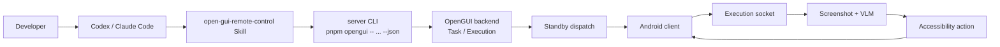

<p align="center">
  <strong>Language:</strong> <a href="./codex-remote-control.md">English</a> | <a href="./codex-remote-control.zh-CN.md">简体中文</a> | <a href="./codex-remote-control.ja-JP.md">日本語</a>
</p>

# Control an Android Phone with Codex

OpenGUI lets Codex or Claude Code hand natural-language tasks to a real Android phone. The coding agent does not click raw coordinates or handle the Android socket protocol directly. It creates tasks through the OpenGUI backend, which dispatches each execution to an online Android client.

## End-to-End Flow

Codex or Claude Code is the command entry point. The OpenGUI backend stores task and execution state, while the Android client captures screenshots, performs actions, and reports device state. A task enters the backend, is dispatched through the standby connection, and then runs through the execution socket loop.



A `task` defines what should be done. An `execution` is one concrete run of that task. A task can run multiple times, and every run receives a new `executionId`. The `do` command creates a task and immediately starts an execution. `run <taskId>` starts a new execution for an existing task. `status <executionId>` reads the status of a specific run.

## Skill Responsibilities

Use `open-gui-bootstrap` to start OpenGUI. It checks the repository, installs dependencies, starts the backend, builds and installs the Android client, configures `adb reverse`, and handles model configuration.

Use `open-gui-remote-control` to control a phone that is already connected to OpenGUI. It handles device discovery, task creation and execution, status checks, pause, resume, and cancel operations.

From a clean environment, run bootstrap first. When the backend is running and the Android client is installed and online, use remote control directly.

## Runtime Environment

Local phone control should run on the development machine connected to the Android device. The machine needs Node.js 22, pnpm, Docker, Java, and adb, together with a runnable OpenGUI checkout:

```text
https://github.com/Core-Mate/OpenGUI
```

The checkout must contain:

```text
server/package.json
client/start.sh
```

Approve USB debugging on Android, then enable the OpenGUI Accessibility Service and overlay permission. When a USB-connected phone uses the local backend, configure reverse port forwarding:

```bash
adb reverse tcp:7777 tcp:7777
```

The default backend URL is:

```text
http://localhost:7777
```

The backend must be reachable before the Android client can maintain its standby connection. If the client is already installed, keep the app open; rebuilding it is not required.

A remote backend is appropriate only when a device bridge is already configured. A regular USB phone should not silently be paired with a remote backend because USB debugging, APK installation, and `adb reverse` happen on the machine physically connected to the phone.

## Usage

When OpenGUI is already running, give Codex or Claude Code this prompt:

```text
Read ./skills/open-gui-remote-control/SKILL.md and use OpenGUI to control my Android phone.
Task: Observe the current Android screen, briefly describe what you see, and then finish.
Only ask me for phone-side permissions or missing secrets.
```

If OpenGUI is not running yet, bootstrap it before entering remote control:

```text
Read ./skills/open-gui-bootstrap/SKILL.md first to start OpenGUI.
Then read ./skills/open-gui-remote-control/SKILL.md and run this phone task:
Observe the current Android screen, briefly describe what you see, and then finish.
```

The Skill uses the repository CLI first. The equivalent local commands are:

```bash
cd server
pnpm opengui -- devices --json
pnpm opengui -- do "Observe the current Android screen, briefly describe what you see, and then finish" --json
```

`do` starts the execution asynchronously and returns after the execution is
created; it does not stream progress or wait for completion. The response
includes an `executionId`. Use it to check the current status:

```bash
pnpm opengui -- status <executionId> --json
```

`status` returns one snapshot, so run it again whenever you want an update.
Check `executionStatus` and, when present, `statusMessage`, `currentStep`,
`executionResult`, or `errorMessage`. `PENDING` means the execution is waiting
to start on the phone, `RUNNING` means it is active, and `FINISHED` means it has
completed. Fine-grained fields are not always present, so a `RUNNING` snapshot
may not distinguish a model wait from a phone wait. If `do` itself does not
return an `executionId`, treat that as a request or startup problem rather than
normal asynchronous execution. Keep the same `executionId` if you need to stop
the active task:

```bash
pnpm opengui -- cancel <executionId> --json
```

When multiple devices are online, list them first and target a specific device:

```bash
pnpm opengui -- devices --json
pnpm opengui -- do "Open Settings and check the current network status" --device <deviceId> --json
```

Specify the base URL when the backend does not use the default address:

```bash
pnpm opengui -- devices --base-url <url> --json
```

Use `--json` to return structured data that Codex or Claude Code can parse for `deviceId`, `taskId`, `executionId`, and execution status.

## Execution Model

OpenGUI does not use fixed coordinate scripts. `adb shell input tap` can click a static coordinate, but it cannot understand the current screen or know how far a task has progressed. Permission dialogs, login pages, network loading, recommendation overlays, and system interruptions can all break a coordinate-only script.

OpenGUI stores execution state in the backend. The Android client uploads screenshots and device state, the VLM interprets the screen and selects the next action, and Android AccessibilityService performs that action. Codex or Claude Code only needs to monitor and control the execution through the CLI or REST API.

## Troubleshooting

If the repository path is wrong, check whether the current directory or one of its child directories contains `server/package.json` and `client/start.sh`. If not, obtain the runnable repository from `https://github.com/Core-Mate/OpenGUI`.

If `devices` returns an empty list, check that the backend is running, the OpenGUI Android app is open, USB debugging is approved, `adb reverse tcp:7777 tcp:7777` has been applied, and Accessibility Service and overlay permissions are enabled.

If the CLI reports `fetch failed`, first open `http://localhost:7777/docs`. If the backend uses another address, pass it with `--base-url <url>`.

A remote backend cannot control a local USB phone by default. A phone connected through USB and `adb reverse` reaches the backend on its local development machine. Remote operation works only when the phone can reach the remote backend and the required device bridge has already been configured.
