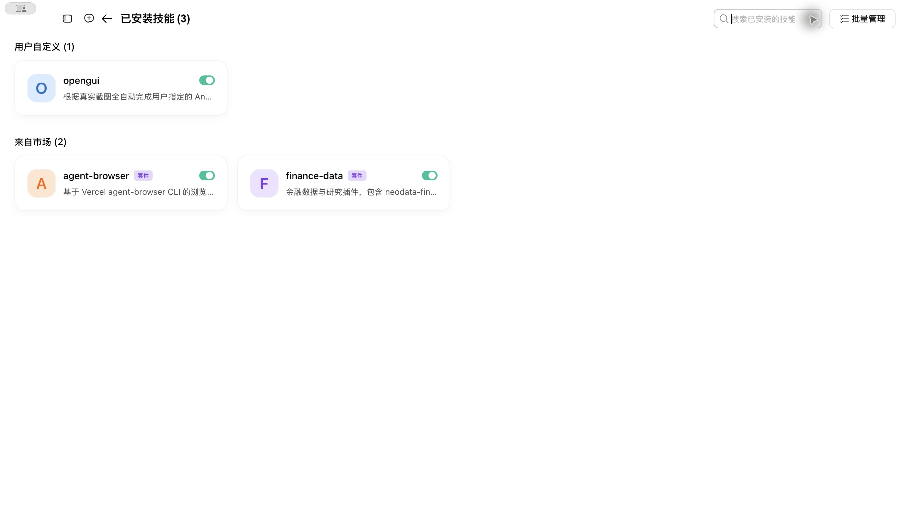
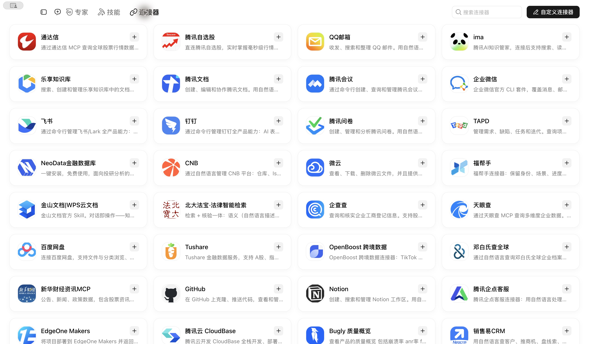
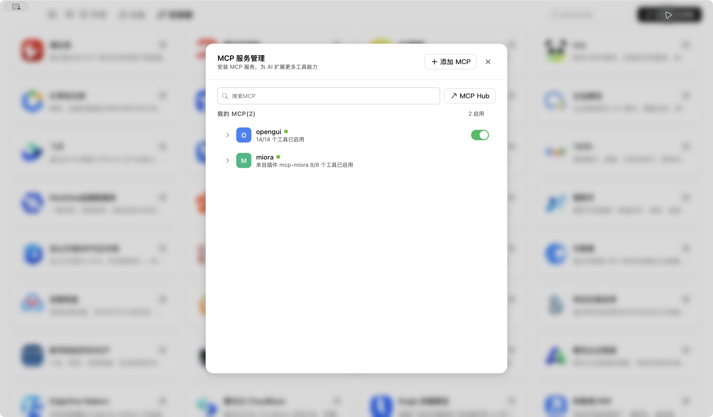

# OpenGUI 开关位置 / Enablement screenshots

**仅在安装助手提示需要手动启用时使用。** 如果助手已自动启用并验证成功，不需要再打开这些页面。Skill 与 MCP 是两个独立开关，只处理尚未开启的那个；绿色表示已开启，不要再次点击关闭。

Use this guide only when the installing assistant needs you to enable a switch manually. Skip it when automatic enablement and verification succeed. Skill and MCP switches are separate; leave green switches on.

截图来自 macOS WorkBuddy 5.7.6，展示**已开启**的目标状态。为便于公开展示，截图时收起了包含个人会话的侧边栏。不同版本的文字或布局可能略有差异。

Screenshots show the enabled state in WorkBuddy 5.7.6 on macOS, with the conversation sidebar collapsed. Labels and layout may vary by version.

## Skill：技能卡片右上角

从左侧 **专家·技能·连接器 → 技能 → 已安装** 进入，找到 `opengui`。把 **卡片右上角的开关**打开。下图中它已经是绿色；若你的开关也是绿色，保持不变。

Go to **Experts · Skills · Connectors → Skills → Installed**. Turn on the switch at the **top-right of the `opengui` card**. The screenshot shows it already on.

如果搜索后只显示“已安装”勾选标记，请清空搜索框，回到已安装技能列表查看开关。“已安装”不等于“已启用”。

If searching replaces the switch with an installed checkmark, clear the search field to see the switch in the installed-skills list. Installed does not necessarily mean enabled.

## MCP：连接器管理中该行最右侧

从左侧 **专家·技能·连接器 → 连接器** 进入，点击页面**右上角的「自定义连接器」**。

Go to **Experts · Skills · Connectors → Connectors**, then click **Custom connector** at the top-right.

在「MCP 服务管理」中找到 `opengui`，打开**这一行最右侧的开关**，等待名称旁的状态点变绿。下图展示成功连接后的状态。

In **MCP service management**, turn on the switch at the **far-right of the `opengui` row**, then wait for the status dot beside its name to turn green.

“14/14 个工具已启用”是工具级别的设置，不能代替右侧服务总开关；工具数量也可能随版本变化。如果开关已开、状态仍不是绿色，请把实际状态告诉安装助手，无需反复开关或重新安装。

The tool count does not replace the server switch and may vary by version. If the switch is on but the connection indicator is not green, report that state to the assistant rather than repeatedly toggling or reinstalling.

完成后返回安装对话，让助手重新发现并调用 `opengui_list_devices` 验证。这个检查只列出设备，不操作手机。

Return to the installation conversation so the assistant can rediscover and call `opengui_list_devices`. This check lists devices without operating them.
